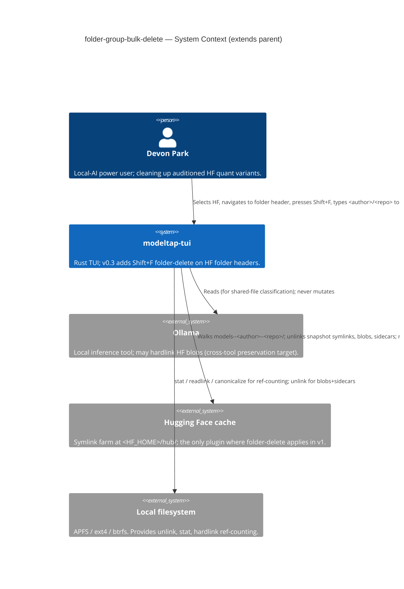
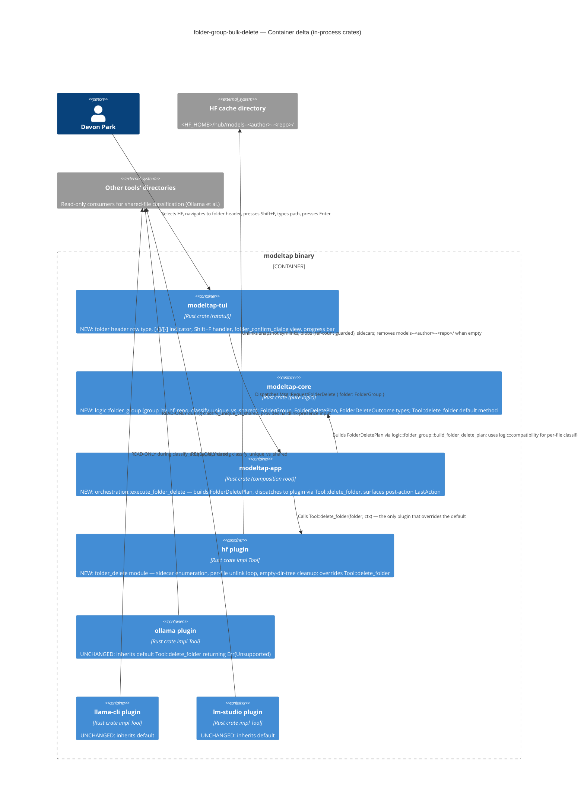
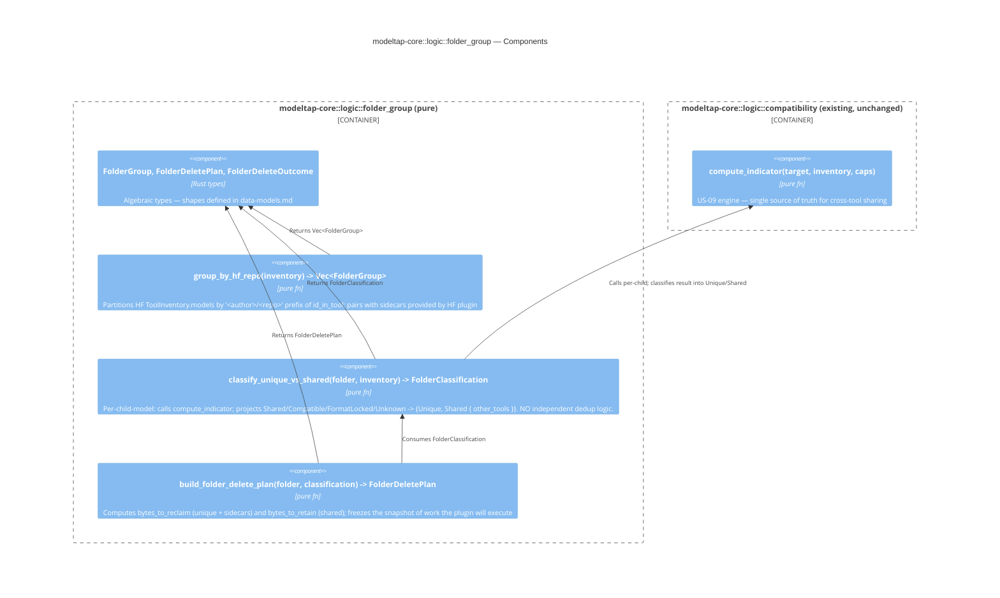
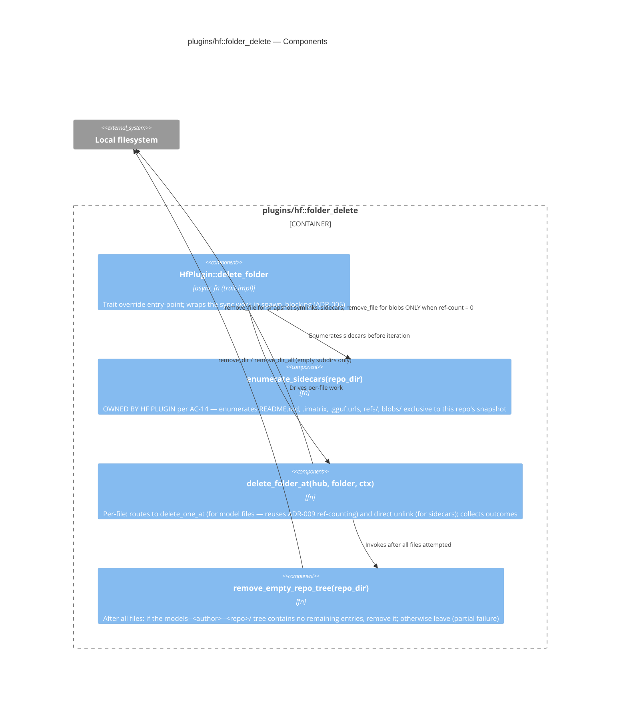

# Architecture Design — folder-group-bulk-delete

**Wave:** DESIGN (3 of 6) — brownfield extension of `modeltap-tui`
**Author:** Morgan (nw-solution-architect)
**Date:** 2026-05-11
**Parent design:** `docs/feature/modeltap-tui/design/architecture-design.md`
**Authoritative inputs:** DISCUSS artifacts under `docs/feature/folder-group-bulk-delete/discuss/`, ADR-009, project `CLAUDE.md`.

## 1. Architecture Summary (5 lines)

1. **Trait extension, not new plugin family.** A seventh method `delete_folder(&FolderGroup) -> Result<Vec<DeleteOutcome>, DeleteError>` is added to `Tool` with a default body returning `Err(DeleteError::Unsupported)`. The HF plugin overrides; the other three plugins inherit the default with zero source changes. Captured in ADR-010.
2. **No new crate.** Folder grouping is pure logic; it lands in `modeltap-core::logic::folder_group` over the existing `Inventory`. Folder enumeration of sidecars + the unlink loop land in `plugins/hf::folder_delete`. Dialog wiring lands in `modeltap-tui::view::folder_confirm_dialog` and `input/keymap.rs`. Orchestration lands in `modeltap-app::orchestration::execute_folder_delete`.
3. **Per-file classification reuses US-09 engine verbatim.** `classify_unique_vs_shared(folder_group, inventory)` is a thin pure adaptor that calls `logic::compatibility::compute_indicator` per child model and projects the result to `{Unique, Shared { other_tools }}`. Single-engine invariant (D-FGD-4) is enforced at the call site.
4. **Concurrency model: per-file detect-and-prompt-then-retry, inherited from ADR-009.** No folder-level lock, no atomic-or-nothing semantics. Partial-failure handling is the contract (D-FGD-6, AC-12).
5. **Style:** preserves the parent's modular monolith + hexagonal seams. Pure core, async edges, OOP-with-traits at the plugin boundary, Elm-style TUI update loop. No paradigm shift.

## 2. Quality Attribute Priorities (inherited and reaffirmed)

Same priorities as the parent (`architecture-design.md` §2): **Safety > Maintainability > Responsiveness > Testability > Portability**. This feature is additive; no priority re-ordering is necessary.

Feature-specific NFR commitments from `requirements.md`:

| NFR | Target | Strategy |
|---|---|---|
| Folder-grouping inventory pass | ≤200 ms for ≤500 folder groups | Pure grouping over already-discovered `Vec<ModelMeta>`; no new I/O on the discovery path. Sidecar enumeration adds a single `walkdir` pass under each `models--<author>--<repo>/` and is parallelizable per-folder via `tokio::spawn_blocking`. |
| `Shift+F` → dialog open | ≤200 ms | Inventory already in memory; classification is O(N_files). |
| Folder-delete dialog open + classification | ≤200 ms | Per-file `compute_indicator` over folder's children only (typical 1–30 files). |
| Summary bar refresh post-action | ≤500 ms (US-11 invariant extended) | Same refresh path as parent's `last_action.bytes_reclaimed`. |

## 3. Conway's Law Check

Same as parent: one developer, one team, one boundary. The trait extension is a **public-API contract change** — ADR-010 is the SemVer signal to OSS contributors that adding a 5th tool must implement the new method OR inherit the default. The default body keeps the contract source-compatible.

## 4. C4 Diagrams

### 4.1 System Context (Level 1)



### 4.2 Container (Level 2) — feature-scoped delta

This diagram shows ONLY the containers and modules touched by US-05c. The full container map is in the parent design.



### 4.3 Component (Level 3) — `modeltap-core::logic::folder_group`

Justification for L3: this subsystem contains the single-engine invariant (D-FGD-4 / AC-13) that the peer review will scrutinize most heavily. Other touched modules are simple enough to read from §5 below.



**Single-engine invariant:** `classify_unique_vs_shared` calls `compute_indicator` on each child model. It does NOT re-implement dedup-key comparison, hardlink-presence detection, or format-locked detection. Any drift would be a build-time failure (the compatibility engine's return type is the only way to learn about sharing).

### 4.4 Component (Level 3) — `plugins/hf::folder_delete` (informational)



## 5. Component Boundaries (this feature's delta)

Detailed boundary spec in `component-boundaries.md`. Summary of new module additions:

| Crate | New module | Responsibility | Lines (estimated) |
|---|---|---|---|
| `modeltap-core` | `logic::folder_group` | pure: grouping, classification (adaptor over `compatibility`), plan-building | ~120 |
| `modeltap-core` | `types` (extended) | `FolderGroup`, `FolderDeletePlan`, `FolderDeleteOutcome`, `Sidecar`, `FolderDeleteError` | ~80 |
| `modeltap-core` | `tool` (extended) | one method added with default `Err(DeleteError::Unsupported)` | ~10 |
| `plugins/hf` | `folder_delete` | sidecar enumeration, per-file unlink loop, empty-tree cleanup, `Tool::delete_folder` impl | ~200 |
| `modeltap-tui` | `view::folder_confirm_dialog` | new dialog view (typed-input mirroring `confirm_dialog`) | ~120 |
| `modeltap-tui` | `view::two_pane` (extended) | folder-header row type, `[+]`/`[-]` indicator, indented children, dim sidecar rows | ~60 |
| `modeltap-tui` | `input/keymap` (extended) | `Shift+F` added to `SHORTCUT_TABLE`; dispatch to `Msg::RequestFolderDelete` | ~30 |
| `modeltap-app` | `orchestration::execute_folder_delete` | builds plan, runs pre-flight (cache-writeable + folder-exists), calls `Tool::delete_folder`, produces `LastAction` | ~100 |

**Dependency-inversion seams (testing surface):**

| Seam | What it enables |
|---|---|
| `Tool::delete_folder` trait method | Acceptance tests can substitute a fake plugin; software-crafter can write the HF impl after the orchestrator is written |
| `logic::folder_group::*` pure functions | Unit-testable with synthetic `Inventory` values; no I/O |
| `classify_unique_vs_shared` over `compute_indicator` | The single-engine invariant is verifiable by inspection: this function CANNOT classify shared vs unique without going through the US-09 engine |
| `FolderDeletePlan` produced by orchestrator, consumed by plugin | Test doubles can capture the plan to assert on what the plugin would have been asked to do, without filesystem mutation |
| `FsProbe` port (parent) for pre-flight checks | Cache-writeable and folder-exists checks are mockable |

## 6. Tool Trait — added method (ADR-010)

```rust
// In modeltap-core::tool — appended to the existing trait.
//
// ADR-010 specifies the default body. The HF plugin overrides; all other
// plugins inherit and report Unsupported, which the orchestrator translates
// into a no-op-with-message at the UI layer.

#[async_trait::async_trait]
pub trait Tool: Send + Sync {
    // ... existing 6 methods unchanged ...

    /// Delete every file in a folder-group from THIS tool's storage. Default
    /// returns `Err(DeleteError::Unsupported)` so non-folder-aware plugins
    /// (Ollama, llama-cli, LM Studio) compile without changes. Per ADR-010
    /// + B-FGD-1, only the HF plugin overrides in v1.
    async fn delete_folder(
        &self,
        folder: &FolderGroup,
    ) -> Result<Vec<DeleteOutcome>, DeleteError> {
        let _ = folder;
        Err(DeleteError::Unsupported(
            format!("{} does not support folder-delete", self.name()),
        ))
    }
}
```

The signature mirrors `delete_all` (returns `Vec<DeleteOutcome>` per element) so the existing `LastAction` aggregation in `modeltap-app` works without a parallel code path. `DeleteError::Unsupported` is a NEW variant — see `data-models.md`.

**Why a default method body rather than a separate trait or downcast?** See ADR-010. Short form: the default body is the cheapest, most-Rust-idiomatic, ADR-001-compatible way to keep object-safety AND avoid forcing three non-HF plugins to write `unimplemented!()` stubs. Downcast (B) would require a marker subtrait and a `dyn Any` escape hatch the codebase doesn't currently have. Plugin-private API (C) would require modeltap-app to know `HfPlugin` by concrete type — a violation of the architecture lint (component-boundaries §R5).

## 7. Integration with Existing Stories

| Existing story | Touchpoint | Risk |
|---|---|---|
| US-04 (model row format) | Folder header row is a new row type sharing the same `Row` enum; existing rows untouched | LOW — additive |
| US-05 (whole-tool zap) | Coexists; `[z]` still wipes all of HF if invoked | LOW — orthogonal |
| US-05b (single-model delete) | `[d]` still works on the model-file children of a folder; `delete_one` and `delete_folder` share `delete_one_at` internally so semantics never drift | MEDIUM — covered by ADR-010 reuse |
| US-08 (bottom bar) | `[F]` added to `SHORTCUT_TABLE`; bottom bar render and dispatch share that single source (AC-19) | LOW — invariant preserved |
| US-09 (compatibility engine) | `compute_indicator` is the ONLY shared/unique classification used; verified at the call-site in `classify_unique_vs_shared` | HIGH IF VIOLATED — peer reviewer to inspect call site |
| US-11 (summary bar refresh) | `LastAction` is produced after folder-delete; existing refresh path fires within 500 ms | LOW — same code path |
| US-12 (HF cache discovery) | Sidecar enumeration adds a single `walkdir` pass; integrated into the same `spawn_blocking` envelope as `discover_in` | LOW — additive |
| US-17 (running-tool detection) | `FsProbe::processes_holding` runs over all files in the folder before opening the dialog (soft warning); per-file EBUSY on execution surfaces as a partial-failure entry | LOW — same port |
| US-18 (5th-tool extensibility) | Default method body means future plugins compile without implementing `delete_folder` | LOW — the whole point of the default |
| US-19 (cross-fs fallback) | Not triggered: folder-delete only unlinks; never copies | LOW — n/a |

## 8. Quality Attribute Strategies

### 8.1 Safety (rank 1)

- **Typed confirmation byte-exact match** (D-FGD-2 / AC-8). The comparator reads `folder_group.path` — not a hardcoded literal (INT-FGD-7).
- **Pre-flight refusal** before the dialog opens (F-FGD-8 / AC-15, AC-20): cache writeable + folder still exists. Both surface as messages, not destructive paths.
- **Single-engine classification** (AC-13). Drift between row indicator and dialog itemization is impossible because both compute from `compute_indicator`.
- **Cross-tool hardlink preservation** (INT-FGD-4). Verified by the HF plugin's existing `delete_one_at` ref-counting: a blob is removed only when no surviving snapshot in this repo references it. **Important nuance:** ADR-009 ref-counting is scoped per-repo-dir; cross-tool hardlinks survive because the other tool's path is in a different inode reference outside HF's blob, accounted for by the US-09 indicator at classification time. AC-13 + AC-10 together cover this.
- **Partial-failure semantics** (D-FGD-6 / AC-12). The plugin returns `Vec<DeleteOutcome>` where each entry's `registration_removed` + `file_deleted` + `bytes_freed` describe what actually happened. The orchestrator aggregates into `ActionStatus::PartialSuccess { succeeded, total }` and `LastAction.detail` lists per-file failures.

### 8.2 Maintainability / extensibility (rank 2)

- **Default-method extension preserves the "one line in a registry adds a plugin" property.** ADR-010 §Consequences spells this out.
- **No new dependencies** (see `technology-stack.md`). Reuse `walkdir` (already used by HF discovery), `async-trait`, `tokio`.
- **Architecture lint rules unchanged.** The new module additions stay within the existing crate boundaries; `cargo metadata`-based lint test (component-boundaries §R1–R6) catches accidental violations.
- **Plugin contract test extended:** a new parameterized contract test `tests/folder_delete_contract.rs` in `modeltap-core/tests/` asserts that any `T: Tool` either (a) returns `Err(Unsupported)` from `delete_folder` OR (b) honors the folder-delete contract (idempotent, partial-failure-tolerant, cross-tool-hardlink-preserving). The HF plugin's contract test runs path (b); the other three plugins' contract tests assert path (a).

### 8.3 Responsiveness (rank 3)

- Grouping is O(N) over already-in-memory `Vec<ModelMeta>`; classification is O(N × M) where N = folder file count (typical 1–30) and M = inventory size (typical < 500). Well under the 200 ms dialog-open NFR (NF-FGD-1).
- The dialog-open path does NOT compute SHA256 lazily — classification is over the existing dedup keys in inventory. If a child model still has `DedupKey::Tentative`, the conservative-when-uncertain rule in `compute_indicator` returns `Compatible` (single-tool) and classification projects to `Unique`. **Consequence:** a child whose hash is not yet computed may be classified as "unique to HF" and fully deleted even if another tool also has that file. This is acceptable because (a) the existing US-09 indicator on the row shows the same `o` glyph (so the user sees consistent information), and (b) the cross-tool hardlink (if one exists at the inode level inside HF's blob ref-count) still survives because the HF plugin's `delete_one_at` ref-counts by canonicalized path before unlinking the blob. The peer review will scrutinize this; see Risk R1 in §10.
- Per-file unlinks are sequential within the folder (no fan-out); a 21-file folder completes well under the 200-ms dialog-open budget plus a sub-second filesystem pass.
- **Progress bar** (NF-FGD-1, journey Step 3) shown for folders with ≥10 files; the same mid-execution affordance the parent already uses for `delete_all`.

### 8.4 Testability (rank 4)

Outside-In TDD seams (DELIVER will use):

- **Acceptance tests** through `modeltap-app` with a fake HF plugin (in-memory) that implements `delete_folder` to return a parameterized `Vec<DeleteOutcome>` — exercises orchestration, plan building, post-action aggregation, partial-failure rendering. Does not touch a real filesystem.
- **Unit tests** on `logic::folder_group::{group_by_hf_repo, classify_unique_vs_shared, build_folder_delete_plan}` with synthetic `Inventory` values. Pure functions; no mocks.
- **Plugin contract tests** in `plugins/hf/tests/folder_delete_contract.rs` with `tempfile`-backed fixture trees: empty repo, single-file repo, mixed unique+shared repo, repo with sidecars, repo with EBUSY-simulated unlink failure (per-file partial), read-only cache (pre-flight refusal).
- **TUI tests** via `ratatui::backend::TestBackend` + `insta` snapshots: folder header row rendering (collapsed and expanded), `[F]` shortcut in bottom bar (dim when not applicable), folder-delete dialog content, post-action summary (success and partial-failure variants).

### 8.5 Cross-platform portability (rank 5)

- HF cache layout is identical on macOS and Linux (parent US-12 + US-20). No new platform code.
- WSL-only on Windows (CLAUDE.md constraint). The HF plugin's existing `discover_in` already abstracts over this; folder-delete inherits.
- The `Sidecar` enumeration uses `walkdir` which works identically across platforms.

## 9. Integration Patterns

No external network integrations (parent §9 still applies). No contract tests against external APIs. The plugin contract test pattern (parent §8.4) is extended to cover `delete_folder` for HF and `Err(Unsupported)` for the other three plugins.

**External integration annotation for platform-architect (DEVOPS handoff):** none. This feature is filesystem-mediated only, identical to parent.

## 10. Risks

| ID | Risk | Likelihood | Impact | Mitigation |
|---|---|---|---|---|
| R1 | Classification uses tentative dedup keys (SHA256 not yet computed at first paint), mis-classifying a shared file as unique | MEDIUM | MEDIUM | (a) `compute_indicator` conservative-when-uncertain rule already returns `Compatible` (not `Shared`) when either side's hash is missing — so shared classification cannot be a false positive. (b) `HfPlugin::delete_folder` ref-counts blobs by canonicalized path before unlinking — cross-tool hardlinks at the inode level survive even when classification mis-labels. The visible effect is a Retained line of 0.0 GB when it should have been larger; the user-visible bytes-reclaimed is still correct. (c) DELIVER step: add a property test asserting `compute_indicator(_, _, _) != Shared` when any input has `Tentative` dedup key. |
| R2 | Sidecar enumeration drift across HF versions | MEDIUM | LOW | Owned by HF plugin (AC-14, B-FGD-2). Adding a new sidecar type = patch to `plugins/hf/folder_delete::enumerate_sidecars`. No core change. |
| R3 | User accidentally deletes wrong folder via typed-confirm bypass | LOW | HIGH | Byte-exact comparison (AC-8); empty input cancels; Esc cancels (AC-9). K-FGD-3 tracks mis-target rate. |
| R4 | Default trait method silently masks a missing implementation on a future folder-aware plugin | LOW | MEDIUM | Plugin contract test in DELIVER asserts each plugin's `delete_folder` is either explicitly the default (returns `Unsupported`) OR returns coherent outcomes — no accidental third state. |
| R5 | Empty `models--<author>--<repo>/` directory left behind on partial failure | MEDIUM | LOW | `remove_empty_repo_tree` is best-effort: removes empty subdirs only; leaves non-empty subtrees in place. Re-run after the user closes the offending tool finishes the cleanup (D-FGD-6). |
| R6 | Pre-flight folder-exists check race with out-of-band deletion (folder vanishes between Shift+F and dialog open) | LOW | LOW | AC-20 already specifies the second pre-flight check. If the folder vanishes between pre-flight and confirmation, the per-file unlinks return `NotFound` and the post-action shows `partial: 0 of N files removed` with reasons — no false data loss. |

## 11. Deployment / Distribution

Inherits parent §10. No new binaries, no new platform targets. The CI matrix (DEVOPS will own) adds `cargo test -p modeltap-plugin-hf folder_delete_contract` to the existing per-plugin contract test invocation.

## 12. ADR Index (this feature)

| ADR | Title | Status |
|---|---|---|
| ADR-010 | Folder-Group Delete — HF Capability via Trait Default-Method | Accepted |

The concurrency model decision (Q-FGD-2) is captured inline in ADR-010 because the decision is "inherit ADR-009 per-file pattern" — there is no new architectural commitment that warrants a separate ADR.

The folder dedup-key question (Q-FGD-3) is closed in `component-boundaries.md` §"No new artifact for folder dedup key" because the answer is "no new artifact; `folder_group.path` IS canonical by construction."

## 13. Definition of Done (DESIGN wave)

- [x] Requirements traced to components (§5 maps each requirement to a module).
- [x] Component boundaries with clear responsibilities (`component-boundaries.md`).
- [x] Technology choices in ADRs with alternatives (ADR-010).
- [x] Quality attributes addressed (§8): safety, maintainability, responsiveness, testability, portability.
- [x] Dependency-inversion compliance: `modeltap-core` adds pure logic + the trait extension; the HF plugin adds the override; the orchestrator composes — no plugin knows another plugin; no core depends on a plugin.
- [x] C4 diagrams: L1 (§4.1), L2 (§4.2), L3 for `modeltap-core::logic::folder_group` (§4.3) and `plugins/hf::folder_delete` (§4.4) — Mermaid.
- [x] Integration patterns specified (§9 — none new; plugin contract test pattern extended).
- [x] OSS preference validated: zero new dependencies (`technology-stack.md`).
- [x] AC behavioral, not implementation-coupled: design defers to DISCUSS AC and adds no implementation-coupled AC.
- [x] External integrations annotated with contract-test recommendation: §9 — none in v1; plugin contract test is the analog.
- [x] Architectural enforcement tooling recommended: §8.2 — existing workspace-level architecture lint test covers the new module additions without modification.
- [ ] Peer review: invoked at the end of DESIGN per protocol (Phase 6).
