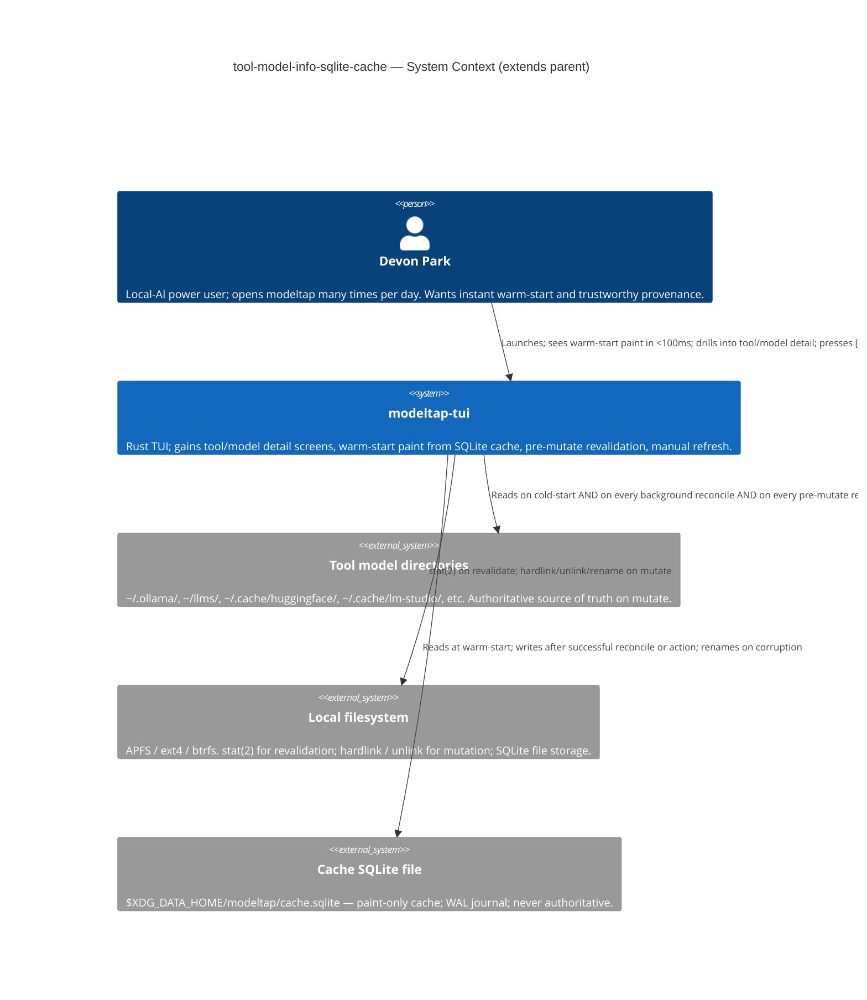
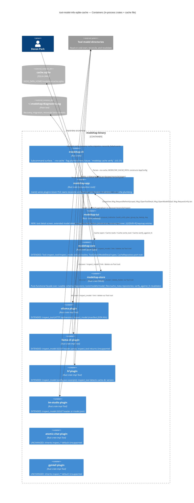
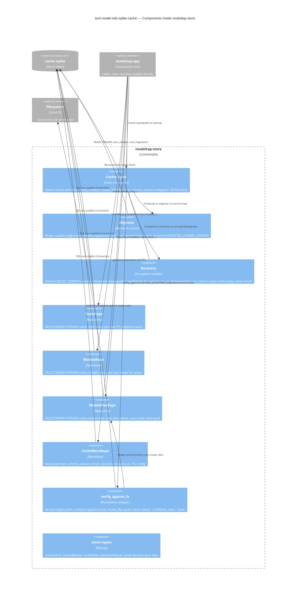

# Architecture Design — tool-model-info-sqlite-cache

**Wave:** DESIGN (3 of 6) — brownfield extension of `modeltap-tui`
**Author:** Morgan (nw-solution-architect)
**Date:** 2026-05-17
**Parent design:** `docs/feature/modeltap-tui/design/architecture-design.md`
**Sibling design (in-flight DELIVER):** `docs/feature/folder-group-bulk-delete/design/architecture-design.md`
**Authoritative inputs:** DISCUSS artifacts under `docs/feature/tool-model-info-sqlite-cache/discuss/`, project `CLAUDE.md`, ADRs 001/003/005/006/010/013.

## 1. Architecture Summary (5 lines)

1. **New crate: `crates/modeltap-store`.** Pure-functional facade over `rusqlite` + `rusqlite_migration` (sync I/O at the edge, pure transforms internally). Owns the SQLite file at `$XDG_DATA_HOME/modeltap/cache.sqlite`. Public API is a small set of typed repositories (`tools`, `models`, `model_files`, `cache_meta`) plus a `revalidate` adapter. No tokio dependency in the crate itself; the app calls into it via `tokio::task::spawn_blocking` for the few writes that happen on hot paths.
2. **`Tool` trait gains two source-compatible methods.** `inspect_tool() -> Result<ToolDetail, InspectError>` and `inspect_model(&ModelId) -> Result<ModelDetail, InspectError>`, both with default bodies returning `Err(InspectError::Unsupported { tool: self.name() })`. Symmetric with `delete_folder` (ADR-010). Object-safety preserved; existing plugins compile with zero source changes; HF plugin's in-flight `delete_folder` work is orthogonal.
3. **Cache safety rule is an enforced invariant: cache is paint-only, filesystem is authoritative on mutate.** Every destructive code path goes through `Cache::verify_against_fs(model_id) -> {Match, Drift, Gone}`. Verified by integration test that greps for unguarded `hard_link` / `remove_file` / `rename` calls in mutation modules. Enforced by `cargo-deny` / architecture-lint at CI.
4. **Cache failure NEVER blocks launch.** Cold-start (ADR-003 path) is the guaranteed-good fallback. Corruption → rename `.corrupt-<timestamp>` → cold-start. Downgrade → rename `.future-version-<n>` → cold-start. Schema mismatch → forward-migrate or rename + cold-start. `--no-cache` flag and `cache.enabled = false` config produce a true bypass (zero bytes written).
5. **Style:** preserves parent's modular monolith with hexagonal seams. Pure core, async edges, OOP-with-traits at the plugin boundary, Elm-style TUI update loop (ADR-006). The store is a **secondary adapter** behind a `CacheRepository` port — `modeltap-app` depends on the port; only the composition root knows about `rusqlite`.

## 2. Quality Attribute Priorities

Reaffirmed and re-ordered for this feature (per `outcome-kpis.md`):

| Rank | Attribute | Drivers |
|---|---|---|
| 1 | **Latency** | K-INFO-1 warm-start ≤100 ms p90; K-INFO-2 manual refresh ≤1 s p90; K-INFO-7 cache overhead ≤50 ms. |
| 2 | **Trust / correctness** | K5 zero accidental loss (parent guardrail, extended); cache must never enable stale-data destructive action; pre-mutate revalidation is the invariant. |
| 3 | **Recoverability** | US-23 SQLite corruption recovery; WAL + busy_timeout for concurrent processes; forward-only idempotent migrations (C-INFO-6). |
| 4 | **Testability** | Outside-In TDD for DELIVER; `modeltap-store` is a pure-functional facade so the pure layer is unit-testable without a SQLite file via an in-memory `:memory:` opener. |
| 5 | **Maintainability** | Solo dev; minimum new dependency surface (3 crates: `rusqlite`, `rusqlite_migration`, `dirs`); architecture-lint enforces the seams. |

## 3. Conway's Law Check

Solo developer, single team, single repository. No Conway conflicts. The `Tool` trait extension is the only public-API contract change, and ADR-016 records it for OSS contributors (Riley Chen persona). Default-body methods keep the extension source-compatible.

## 4. C4 Diagrams

### 4.1 System Context (Level 1)



### 4.2 Container (Level 2)



### 4.3 Component (Level 3) — `modeltap-store`

The cache layer has enough internal structure (migrations + 4 repositories + revalidator + recovery) to warrant a component diagram.



## 5. Component Architecture

### 5.1 New crate: `modeltap-store`

**Owns:** SQLite cache lifecycle (open, migrate, recover, close); typed repositories for `cache_tools`, `cache_models`, `cache_model_files`, `cache_meta`; the `verify_against_fs` revalidator; the embedded `migrations/*.sql` directory; schema-version constant `EXPECTED_SCHEMA_VERSION`.

**Does NOT own:** any tokio dependency; any TUI dependency; the reconcile orchestrator (that's `modeltap-app`); the pre-mutate decision logic (that's `modeltap-app::orchestration`, which calls `verify_against_fs`); domain types beyond the cache row types (those stay in `modeltap-core`).

**Allowed dependencies:** `rusqlite` (with `bundled` feature so we ship a known SQLite version regardless of system SQLite); `rusqlite_migration`; `modeltap-core` (for cross-cutting domain types like `ToolId`, `ModelId`); `serde` (for JSON columns); `thiserror` (error model); `time` (timestamp formatting).

**Forbidden dependencies:** `tokio`, `ratatui`, any plugin crate. Architecture-lint enforces.

**Public API surface (pseudo-Rust, for clarity — implementation is software-crafter's):**

```rust
pub struct Cache { /* opaque */ }

pub enum CacheOpenResult {
    OpenedExisting(Cache),
    OpenedAfterMigration { from: u32, to: u32, cache: Cache },
    OpenedAfterRecovery { reason: RecoveryReason, renamed_to: PathBuf, cache: Cache },
    OpenedFresh(Cache),
}

pub enum RecoveryReason { Corrupted, Downgrade { found: u32, expected: u32 }, MigrationFailed { from: u32, to: u32 } }

pub enum ValidationResult { Match, Drift { fresh: FileStat }, Gone }

impl Cache {
    pub fn open(path: &Path) -> Result<CacheOpenResult, CacheError>;
    pub fn open_in_memory() -> Result<Cache, CacheError>;  // for tests
    pub fn tools(&self) -> Result<Vec<CachedTool>, CacheError>;
    pub fn models_for_tool(&self, tool_id: &ToolId) -> Result<Vec<CachedModel>, CacheError>;
    pub fn files_for_model(&self, model_id: &ModelId) -> Result<Vec<CachedFile>, CacheError>;
    pub fn write_tool(&self, tool: &CachedTool) -> Result<(), CacheError>;
    pub fn write_models(&self, tool_id: &ToolId, models: &[CachedModel]) -> Result<(), CacheError>;
    pub fn write_files(&self, model_id: &ModelId, files: &[CachedFile]) -> Result<(), CacheError>;
    pub fn meta_get(&self, key: &str) -> Result<Option<String>, CacheError>;
    pub fn meta_set(&self, key: &str, value: &str) -> Result<(), CacheError>;
    pub fn verify_against_fs(&self, model_id: &ModelId) -> Result<ValidationResult, CacheError>;
    pub fn ttl_eligible(&self, tool_id: &ToolId, ttl_seconds: u64, now: SystemTime) -> Result<bool, CacheError>;
}
```

Note: this is a **port surface for the cache**, not an implementation. The trait/struct shape is intentionally close to the rusqlite-shaped repositories — there is no abstract `CacheRepository` trait in `modeltap-core` for this feature. The seam is "the `modeltap-store` crate is the implementation; the only consumer is `modeltap-app`." Architecture-lint enforces that no other crate imports `modeltap-store`.

Rationale for not introducing an abstract `CacheRepository` trait: the only consumer is the composition root; there is no test that swaps a real cache for a fake (tests use `Cache::open_in_memory()`); abstracting prematurely violates the "simplest solution first" principle. If a second consumer or a mock-cache-for-property-test materializes later, extract the trait then.

### 5.2 Extended `Tool` trait in `modeltap-core`

Two new methods, both with default bodies, mirroring ADR-010's `delete_folder` pattern:

```rust
#[async_trait::async_trait]
pub trait Tool: Send + Sync {
    // ... existing 6 methods (discover, link, delete_all, delete_one, link_dry_run, name) ...
    // ... existing 7th method (delete_folder, ADR-010) ...

    async fn inspect_tool(&self) -> Result<ToolDetail, InspectError> {
        Err(InspectError::Unsupported { tool: self.name() })
    }

    async fn inspect_model(&self, id: &ModelId) -> Result<ModelDetail, InspectError> {
        let _ = id;
        Err(InspectError::Unsupported { tool: self.name() })
    }
}
```

New domain types in `modeltap-core::domain::inspect`:

```rust
pub struct ToolDetail {
    pub tool_id: ToolId,
    pub install_path: PathBuf,
    pub detected_version: Option<String>,    // None renders as "(not detectable)"
    pub plugin_version: String,
    pub search_paths: Vec<SearchPath>,       // each tagged Default or UserConfig
    pub model_count: usize,
    pub disk_usage_bytes: u64,
    pub largest_model: Option<ModelId>,
    pub last_scan_at: Option<SystemTime>,
    pub last_scan_duration_ms: Option<u64>,
    pub last_error: Option<String>,
    pub last_error_at: Option<SystemTime>,
}

pub struct ModelDetail {
    pub model_id: ModelId,
    pub format: Option<String>,              // "GGUF v3", "Ollama manifest v2", "safetensors v2"
    pub quantisation: Option<String>,        // "Q4_K_M"
    pub architecture: Option<String>,
    pub parameters: Option<f64>,             // billions
    pub context_length: Option<u32>,
    pub metadata_kv: BTreeMap<String, String>,  // tool-relevant subset, plugin-defined
    pub introspected_at: Option<SystemTime>,
}

pub enum InspectError {
    Unsupported { tool: ToolId },
    PluginPanic { tool: ToolId, message: String },
    FileReadable { path: PathBuf, source: io::Error },
    FormatUnreadable { path: PathBuf, detail: String },
}
```

Symmetry with ADR-010 is intentional: contributors learn the "default-body trait method" pattern once and apply it everywhere.

### 5.3 Composition-root orchestration extensions in `modeltap-app`

Three new orchestration concerns land in `modeltap-app/src/orchestration/`:

| Module | Responsibility | Inputs | Outputs |
|---|---|---|---|
| `warm_start.rs` | At launch when `cache.enabled` and cache opens cleanly: read `cache_tools` + `cache_models`; build `Inventory`; paint first frame within 100 ms. | `&Cache`, `&AppConfig` | `Inventory` (warm subset) + per-tool TTL eligibility flags |
| `reconcile.rs` | After warm paint OR on `[r]`/`[Shift+R]`: parallel-per-plugin `discover()` (reusing parent's discovery orchestrator with a new `ReconcileScope::{All, Tool(id)}` parameter); atomic per-tool write to cache; emit `Msg::ReconcileComplete { scope, diff_summary }` to TUI. | `Vec<Box<dyn Tool>>`, `&Cache`, `ReconcileScope` | New `Inventory` slices + cache updates |
| `revalidate.rs` | Before every destructive action: call `cache.verify_against_fs(model_id)` for each target; on `Drift`, dispatch a synchronous `inspect_model` call and update the cache before the dialog opens; on `Gone`, abort the action and dispatch a per-tool refresh. | `&Cache`, `&[ModelId]` (targets), `&dyn Tool` (for re-introspect) | `RevalidationOutcome::{Proceed, Refreshed{updated}, Abort{reason}}` |

The pre-mutate revalidator is the **single choke point** for cache safety. Architecture-lint asserts that every mutation site in `orchestration/execute_*` (unify, zap, delete_one, folder_delete) calls `revalidate.rs::pre_mutate(&[targets])` before any `tool.link()` / `tool.delete_*()` call. The lint is implemented as a grep-style invariant in `tests/architecture.rs`.

### 5.4 Architecture rule enforcement

Per CLAUDE.md CI discipline, the project uses a Rust-idiomatic architecture-lint test (the parent feature established this pattern in `tests/architecture.rs`). Three new rules:

- **R7:** Only `modeltap-app` may depend on `modeltap-store`. Other crates (including plugins, `modeltap-tui`, `modeltap-cli`) MUST NOT have `modeltap-store` as a Cargo dependency.
- **R8:** `modeltap-store` MUST NOT depend on `tokio` or `ratatui` (the cache is sync; async happens at the `modeltap-app` boundary via `spawn_blocking`).
- **R9 (the safety invariant):** Every `tool.link(...)`, `tool.delete_one(...)`, `tool.delete_all(...)`, `tool.delete_folder(...)` call site in `modeltap-app/src/orchestration/` MUST be preceded within the same function (or via an explicit `pre_mutate` guard call) by a `revalidate::pre_mutate(...)` invocation. The lint is a Rust-source AST walk implemented in `tests/architecture.rs`; CI fails if any unguarded mutation call is added.

Tooling: hand-rolled lint in `tests/architecture.rs` using `syn` for AST inspection. Rationale: the workspace already uses this pattern (R1-R6 from parent design); adding three rules in the same file is the lowest-friction option. Alternative — `cargo-deny` for crate-dependency rules (R7, R8) — is acceptable if the team prefers off-the-shelf tooling. Software-crafter chooses; ADR-018 records the rationale.

## 6. Technology Stack (rationale per crate)

Detailed rationale lives in `technology-stack.md`. One-line summary per new dependency added by this feature:

| Crate | Version | License | Used For |
|---|---|---|---|
| `rusqlite` | `0.31` | MIT | SQLite bindings with `bundled` feature so we ship a known SQLite version |
| `rusqlite_migration` | `1.2` | MIT/Apache-2.0 | Forward-only embedded SQL migrations; minimal wrapper over rusqlite |
| `dirs` | `5` | MIT/Apache-2.0 | Cross-platform resolution of `$XDG_DATA_HOME` / `~/Library/Application Support` |

No proprietary technology. All OSS, all permissive licenses. No new tokio extensions needed — the store is sync.

## 7. Integration Patterns

### 7.1 Sync-store-from-async-app

`modeltap-store` is sync. `modeltap-app` is async (tokio). Bridge: `tokio::task::spawn_blocking` for any cache I/O that happens on a hot path (warm-start read, per-tool reconcile write, pre-mutate revalidation). For cold-path operations (initial migration on first launch, recovery rename), the app awaits `spawn_blocking` directly. This pattern is already established by ADR-013 (the SHA256 hash pool uses `spawn_blocking`).

### 7.2 Warm-start path (≤100 ms p90)

```
1. main() starts (T0)
2. clap parses args; constructs AppConfig (with --no-cache flag if present)
3. If !cache.enabled: jump to cold-start path (ADR-003)
4. spawn_blocking { Cache::open(path) } — single round-trip
5. If OpenedExisting | OpenedAfterMigration: spawn_blocking { cache.tools() + cache.models_for_tool(_) for each tool } — single round-trip
6. Build Inventory from cached data
7. terminal.draw(view(&state)) — first paint (target: T0 + 100 ms)
8. Dispatch Cmd::StartReconcile { scope: All } — background reconcile starts
9. As each per-tool reconcile completes, update cache atomically and post Msg::ReconcileComplete to TUI
```

Step 7 is the K-INFO-1 target. Steps 4-5 must complete in <50 ms (K-INFO-7 guardrail). Step 7's `view()` is a pure function over the in-memory `AppState`, identical to cold-start rendering.

### 7.3 Pre-mutate revalidation flow

```
User presses [u] (unify) on a Mistral dedup group
  → Msg::RequestUnify { group_id }
  → app::orchestration::execute_unify
    1. Resolve group_id → Vec<ModelId> (targets)
    2. revalidate::pre_mutate(&cache, &targets, &plugins)  ← R9 GATE
       For each target:
         a. spawn_blocking { cache.verify_against_fs(id) }
         b. Match { Match → continue;
                    Drift { fresh } → spawn_blocking { plugin.inspect_model(id) } ;
                                      spawn_blocking { cache.write_models(...) updated };
                                      mark "user must re-confirm if reclaim changed";
                    Gone → return RevalidationOutcome::Abort { reason } }
    3. If any Abort: emit Msg::ActionAborted { reason }; dispatch Msg::RequestRefresh { scope: Tool(affected) }
    4. If any Refreshed AND reclaim changed: emit Msg::UnifyPlanRefreshed; user re-confirms
    5. Else: proceed to tool.link(...) etc.
    6. Post-action: spawn_blocking { cache.write_models(...) with new file states }
```

This flow is the same shape for unify, zap, delete-one, folder-delete. The architecture-lint R9 invariant ensures step 2 is always present.

### 7.4 Corruption recovery flow

```
Cache::open(path)
  → Try rusqlite::Connection::open(path)
    → On SQLITE_CORRUPT: enter Recovery
    → On schema_version > EXPECTED: enter Recovery (downgrade)
    → On schema_version < EXPECTED: enter Migrator
        → Migrator runs forward; on failure: enter Recovery
    → On success: return OpenedExisting

Recovery
  1. Compute new path: cache.sqlite.corrupt-<timestamp> OR cache.sqlite.future-version-<n>
  2. std::fs::rename(path, new_path) — best-effort; absorb errors
  3. Append diagnostics.log line: cache_recovery reason=<reason> renamed_to=<new_path>
  4. Return OpenedFresh(new empty cache at original path)
```

After recovery, the launch proceeds via cold-start (which now has an empty cache to write to). The TUI shows a dismissable banner on first paint.

### 7.5 External integrations

**None added by this feature.** The cache is local-only; tool directories are local; SQLite is in-process. The Ollama plugin's `inspect_tool()` may call `http://localhost:11434/api/version` — this is the *same* localhost HTTP integration already used by the Ollama plugin's `discover()` and is not a new external boundary. No new contract-test recommendation needed; the existing Ollama plugin contract test covers this.

## 8. Quality Attribute Strategies

### 8.1 Latency (K-INFO-1, K-INFO-2, K-INFO-7)

- Warm-start path is **two SQL round-trips** (tools list + models-per-tool); both within `spawn_blocking` to avoid blocking the runtime. Target: <50 ms for cache reads.
- `cache_tools` and `cache_models` indexes on `(tool_id, last_seen_at)` make these queries O(log N) on row count.
- Cold-start is unchanged from ADR-003; warm-start is *additive* speedup, not a replacement.

### 8.2 Trust / correctness (K5 extended)

- The **R9 architecture-lint invariant** (every mutation site preceded by `pre_mutate`) is the load-bearing safety mechanism.
- The `verify_against_fs` revalidator uses the **`(mtime, size, inode, dev)` quad**, not just `(mtime, size)`. Rationale: `inode + dev` defeats most accidental mtime-preserving file replacement (e.g., `cp --preserve=timestamps` produces a new inode); the quad makes false-positive "cache valid" results impossible without an adversarial actor.
- Cache writes are wrapped in `BEGIN IMMEDIATE TRANSACTION ... COMMIT` per action — atomic per peer-process visibility.

### 8.3 Recoverability (K-INFO-4)

- Three failure modes are explicitly recoverable: `SQLITE_CORRUPT` on open, schema downgrade, migration failure.
- All three resolve to **the same outcome**: rename file, log event, cold-start. This single path is integration-tested.
- Migrations are forward-only and idempotent (C-INFO-6): re-running a failed migration produces the same end state OR fails identically. `rusqlite_migration` provides this guarantee out of the box.

### 8.4 Testability

- `Cache::open_in_memory()` enables unit tests against an in-memory SQLite — no temp files, no cleanup.
- All four repositories return `Result<T, CacheError>`; tests inject seed data via `write_*` methods and assert via `*` getters.
- The pre-mutate revalidator is testable end-to-end via `tempfile`-backed fixtures: write a file, populate cache, mutate file, assert `verify_against_fs` returns `Drift`.
- `modeltap-store` ships **its own** plugin-free contract tests under `crates/modeltap-store/tests/`.

### 8.5 Maintainability

- 3 new dependencies. All MIT/Apache-2.0. All under 5K LoC each (small audit surface).
- Architecture-lint enforces R7-R9 at every CI run.
- ADR-015 records the supersession of ADR-003 with full alternatives analysis.

## 9. Deployment Architecture

**Unchanged from parent.** Single binary; macOS / Linux / WSL. The new `modeltap-store` crate adds <1 MB to binary size (rusqlite bundled SQLite C library). Cache file lives at `$XDG_DATA_HOME/modeltap/cache.sqlite`; created on first non-`--no-cache` launch; size grows from ~10 KB (1 tool, 5 models) to ~5 MB (1000 models with metadata KV JSON). No backup, no rotation — corruption recovery is the safety net.

## 10. Coordination with In-Flight `folder-group-bulk-delete`

The folder-group-bulk-delete DELIVER wave (62h roadmap, approved) is currently in progress. This feature's DESIGN must not collide with that work.

**Trait extension additivity:** ADR-010 added `delete_folder()` to the `Tool` trait (method #7). This feature adds `inspect_tool()` (method #8) and `inspect_model()` (method #9), each with default-body returning `Unsupported`. Both are **additive in the exact same shape** as `delete_folder` — same `async_trait` decoration, same default-body fallback, same plugin-contract-test extension pattern. The three methods occupy disjoint method names; there is no signature collision, no ordering dependency.

**Plugin code:** the HF plugin's in-flight `delete_folder` override (introduced by folder-group-bulk-delete) and this feature's HF `inspect_tool` / `inspect_model` overrides land in different modules within `plugins/hf/src/`:
- `plugins/hf/src/folder_delete.rs` — owned by folder-group-bulk-delete
- `plugins/hf/src/inspect.rs` — owned by this feature

No merge conflict risk. The two features can be developed in parallel branches and merged in either order.

**Cross-feature integration AC:** INT-INFO-7 (in `acceptance-criteria.md`) records that `[F]` (folder-delete) also runs through the pre-mutate revalidator. The integration AC lands when this feature's US-26 lands, retroactively covering the folder-delete path. The folder-group-bulk-delete DELIVER does not need to add the revalidator call — `modeltap-app::orchestration::execute_folder_delete` calls `revalidate::pre_mutate` as part of this feature's diff.

**ADR-010 stays in force.** No change required; the trait grows from 7 methods to 9 methods, all source-compatible.

## 11. ADRs Produced by This Design

| ADR | Title | Mandatory? |
|---|---|---|
| ADR-015 | State Model: SQLite-Backed Cache With Pre-Mutate Revalidation (supersedes ADR-003) | Yes |
| ADR-016 | Tool Trait Extension: `inspect_tool()` / `inspect_model()` (Q-INFO-1) | Yes |
| ADR-017 | Schema Migration Strategy: `rusqlite_migration` (Q-INFO-3) | Yes |
| ADR-018 | SHA256 Persistence Boundary and Relationship with ADR-013 | Yes (records the seam even though US-27 is deferred) |

ADR-003 is **edited only** to add the `Superseded-By` header; its content is preserved as historical record.

## 12. Quality Gates Self-Check

| Gate | Status |
|---|---|
| Requirements traced to components | PASS — every US-21..US-27 AC maps to a section in §5 |
| Component boundaries with clear responsibilities | PASS — §5.1 (store), §5.2 (core trait), §5.3 (app), §5.4 (lint rules) |
| Technology choices in ADRs with alternatives | PASS — ADR-017 alternatives analysis; `technology-stack.md` rationale |
| Quality attributes addressed | PASS — §8 maps to ISO 25010 (performance, reliability, maintainability, security-via-privacy) |
| Dependency-inversion compliance | PASS — `modeltap-store` is an adapter; `modeltap-core` does not depend on rusqlite; R7-R8 lint rules enforce |
| C4 diagrams (L1 + L2 minimum, Mermaid) | PASS — L1, L2, L3 (for the store) provided |
| Integration patterns specified | PASS — §7 warm-start, revalidation, recovery flows |
| OSS preference validated | PASS — rusqlite (MIT), rusqlite_migration (MIT/Apache-2.0), dirs (MIT/Apache-2.0) |
| AC behavioral, not implementation-coupled | PASS — DISCUSS owns ACs; this design references them without rewriting |
| External integrations annotated for contract tests | N/A — no new external integrations (localhost Ollama HTTP already covered by parent's plugin contract test) |
| Architectural enforcement tooling recommended | PASS — `tests/architecture.rs` extension (parent pattern) + optional `cargo-deny` for R7/R8 |
| Peer review | PENDING — `peer-review.md` is this design's self-review |

All gates pass. Ready for handoff.
