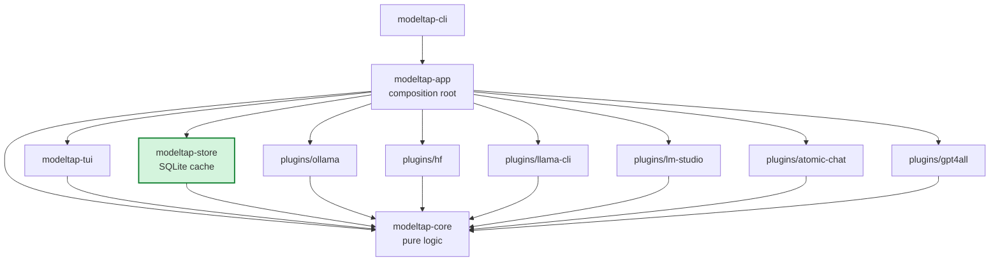

# Component Boundaries — tool-model-info-sqlite-cache

**Wave:** DESIGN (3 of 6) — brownfield extension of `modeltap-tui`
**Author:** Morgan (nw-solution-architect)
**Date:** 2026-05-17
**Parent boundaries:** `docs/feature/modeltap-tui/design/component-boundaries.md`

This document specifies the dependency rules and responsibilities for the workspace after this feature lands. It is an **additive delta** over the parent's component-boundaries — all parent rules (R1-R6) carry forward unchanged.

## Workspace layout after this feature

```
modeltap/
├── Cargo.toml                       # workspace root — adds modeltap-store member
├── crates/
│   ├── modeltap-core/               # UNCHANGED in shape; adds inspect types + trait methods
│   ├── modeltap-tui/                # ADDS tool detail view, provenance widget, recovery banner
│   ├── modeltap-app/                # ADDS warm_start/reconcile/revalidate orchestration
│   ├── modeltap-cli/                # ADDS --no-cache flag plumbing
│   └── modeltap-store/              # NEW CRATE — SQLite cache layer
│       ├── Cargo.toml
│       ├── src/
│       │   ├── lib.rs               # public API: Cache, CacheOpenResult, ValidationResult
│       │   ├── error.rs             # CacheError enum (thiserror)
│       │   ├── open.rs              # Cache::open: orchestrates migrate vs recovery
│       │   ├── migrate.rs           # wrapper over rusqlite_migration; EXPECTED_SCHEMA_VERSION constant
│       │   ├── recovery.rs          # rename + log on corruption / downgrade
│       │   ├── repo/
│       │   │   ├── tools.rs         # ToolsRepo
│       │   │   ├── models.rs        # ModelsRepo
│       │   │   ├── files.rs         # ModelFilesRepo
│       │   │   └── meta.rs          # CacheMetaRepo
│       │   ├── revalidate.rs        # verify_against_fs(model_id) -> ValidationResult
│       │   └── types.rs             # CachedTool, CachedModel, CachedFile, FileStat
│       ├── migrations/
│       │   └── 0001_initial.sql     # v1 schema (US-23)
│       └── tests/
│           ├── corruption.rs        # SQLITE_CORRUPT recovery
│           ├── migration.rs         # migration matrix (v0→v1)
│           ├── revalidate.rs        # (mtime, size, inode, dev) drift detection
│           └── concurrent.rs        # WAL + busy_timeout under two-process load
├── plugins/                         # each plugin adds an inspect.rs module (no Cargo.toml change)
│   ├── ollama/src/inspect.rs        # NEW (US-22)
│   ├── hf/src/inspect.rs            # NEW (US-22; coexists with folder_delete.rs from ADR-010)
│   ├── llama-cli/                   # NEW src/inspect.rs (if plugin exists; else inherits default)
│   ├── lm-studio/src/inspect.rs     # NEW (US-22)
│   ├── atomic-chat/                 # UNCHANGED (inherits default Unsupported)
│   └── gpt4all/                     # UNCHANGED (inherits default Unsupported)
└── tests/architecture.rs            # EXTENDED with R7, R8, R9 (see below)
```

## Crate responsibilities — additions only

### `modeltap-core` (additions, otherwise unchanged)

**New ownership:**
- `domain::inspect::{ToolDetail, ModelDetail, SearchPath, SearchPathSource}` — pure data types for the new trait methods.
- `domain::errors::InspectError` — new error enum variant family.
- `domain::tool::Tool` — gains two default-body async methods `inspect_tool()` and `inspect_model()`. **Object-safety preserved.**

**Still does not:** perform I/O. Open files. Spawn tasks. Touch ratatui. Touch tokio. Touch rusqlite. Know about specific filesystem paths.

**New allowed deps:** none. The new types are pure-derived (`serde::Serialize`/`Deserialize` already available).

### `modeltap-tui` (additions, otherwise unchanged)

**New ownership:**
- `view/tool_detail.rs` — renders `ToolDetail` (US-21)
- `view/model_detail.rs` — extended to include `Metadata` section from `ModelDetail` (US-22)
- `view/provenance.rs` — summary-bar provenance line ("as of <X> ago, reconciling...")
- `view/recovery_banner.rs` — dismissable banner on cache recovery (US-23)
- `input/keymap.rs` — gains `(KeyEvent::Enter, ContextFilter::LeftPaneFocus, Msg::OpenToolDetail)`, `(KeyEvent::r, ContextFilter::NoDialog, Msg::RequestRefresh(Tool))`, `(KeyEvent::Shift+R, ContextFilter::NoDialog, Msg::RequestRefresh(All))`

**Still does not:** perform discovery, perform mutation, talk to the filesystem, know about specific plugins by name. **Still does not depend on `modeltap-store`.** (R7)

**New allowed deps:** none.

### `modeltap-app` (composition root; additions only)

**New ownership:**
- `orchestration/warm_start.rs` — reads cache at launch; builds initial `Inventory`; emits first paint.
- `orchestration/reconcile.rs` — `ReconcileScope::{All, Tool(id)}`; parallel-per-plugin reconcile; atomic cache writes.
- `orchestration/revalidate.rs` — `pre_mutate(&[targets])` choke point; the **single safety gate**.
- `adapters/cache_path.rs` — resolves `$XDG_DATA_HOME/modeltap/cache.sqlite` via `dirs::data_dir()`; respects `MODELTAP_CACHE_PATH` env var.
- `config.rs` — extended with `cache.enabled: bool` (default `true`), `cache.tool_ttl_seconds: u64` (default `86400`).

**New allowed deps:** `modeltap-store`, `dirs`. (Architecture-lint R7 asserts only `modeltap-app` may depend on `modeltap-store`.)

### `modeltap-cli` (additions only)

**New ownership:**
- `--no-cache` clap flag plumbed into `AppConfig` (overrides config-file `cache.enabled`).
- Future (post-US-27) home for `modeltap cache verify`, `modeltap cache clear`, `modeltap cache stats` subcommands. (Deferred; ADR-018 records the seam.)

**New allowed deps:** none beyond existing clap.

### `modeltap-store` (NEW crate)

**Owns:**
- The SQLite cache lifecycle (open, migrate, recover).
- All four repositories (tools, models, model_files, cache_meta).
- The `verify_against_fs` revalidator (the only public function that performs `std::fs::metadata()` calls on behalf of callers).
- The embedded `migrations/*.sql` directory; the compile-time `EXPECTED_SCHEMA_VERSION` constant.

**Does NOT own:**
- The reconcile orchestrator (`modeltap-app::orchestration::reconcile`).
- The pre-mutate decision policy (`modeltap-app::orchestration::revalidate` calls `verify_against_fs` and decides what to do with the result).
- Any tokio task spawning. (The crate is sync.)
- Any plugin-specific knowledge. (Plugins are opaque `Box<dyn Tool>` to this crate; the crate sees only `ToolId` / `ModelId` from `modeltap-core`.)

**Allowed deps:** `rusqlite`, `rusqlite_migration`, `modeltap-core`, `thiserror`, `serde`, `serde_json`, `time`.

**Forbidden deps (lint-enforced):** `tokio`, `ratatui`, any plugin crate. (R8)

**Test layer:** unit tests against `Cache::open_in_memory()`; integration tests under `tests/` with `tempfile`-backed cache files.

### plugins (additions per plugin)

Each plugin that supports inspection adds an `src/inspect.rs` module containing the implementations of `Tool::inspect_tool` and `Tool::inspect_model`. Plugins that do not support inspection (atomic-chat, gpt4all) make no changes — they inherit the default `Unsupported` bodies.

**HF plugin coexistence note:** `plugins/hf/src/folder_delete.rs` (owned by folder-group-bulk-delete) and `plugins/hf/src/inspect.rs` (owned by this feature) are sibling modules with no shared code paths. They can be developed in parallel branches and merged in either order.

## Dependency rules (extends parent R1-R6)

The parent feature established R1-R6 in `tests/architecture.rs`. This feature adds three rules; the test extension is small (~50 LoC of `syn` AST inspection plus a Cargo-manifest check).

### R7 — Only `modeltap-app` may depend on `modeltap-store`

Verified by parsing each crate's `Cargo.toml` and asserting `modeltap-store` appears as a path-dep only in `crates/modeltap-app/Cargo.toml`.

Rationale: `modeltap-store` is a composition-root concern. `modeltap-tui` should not know SQLite exists; `modeltap-core` must remain pure (no rusqlite dep); plugins must not depend on a sibling crate. The seam is "the app wires the cache to the rest of the system."

### R8 — `modeltap-store` MUST NOT depend on `tokio` or `ratatui`

Verified by parsing `crates/modeltap-store/Cargo.toml` and asserting absence of `tokio`, `ratatui`, `crossterm` from `[dependencies]` and `[dev-dependencies]`.

Rationale: the cache layer is sync. Adding tokio creates two concurrency models in the same crate (rusqlite's blocking calls vs tokio's async runtime). The bridge happens at the `modeltap-app` boundary via `spawn_blocking`.

### R9 — Every destructive trait call in `modeltap-app/src/orchestration/` is preceded by `revalidate::pre_mutate`

This is **the load-bearing safety lint**. Verified by AST inspection in `tests/architecture.rs`:

```
For each file under crates/modeltap-app/src/orchestration/:
  For each fn body in the file:
    For each method-call expression that matches:
      - tool.link(...)
      - tool.delete_one(...)
      - tool.delete_all(...)
      - tool.delete_folder(...)
    Assert: an earlier statement in the same fn (or via explicit guard call)
            invokes `revalidate::pre_mutate(...)` against the target set.
```

If a future contributor adds a new mutation method to `Tool` (e.g., `replace_model`), the lint must be extended to cover it. ADR-015 §"Enforcement" records this discipline.

Failure mode: a new `tool.link(...)` call site without an upstream `pre_mutate` call causes `tests/architecture.rs::r9_pre_mutate_guard` to fail at CI, blocking merge. This is the K5-extension guarantee.

### Tooling choice — hand-rolled `syn` AST inspection

Two viable options:

1. **Hand-rolled `syn` AST walk** in `tests/architecture.rs` — the parent feature established this pattern for R1-R6. Adding R7-R9 in the same place is the lowest-friction option.
2. **`cargo-deny`** for crate-dependency rules (R7, R8) + AST lint for R9 — splits enforcement across two tools.

**RECOMMENDED:** Option 1. Single `cargo test --workspace` run catches all violations. `cargo-deny` is appropriate if/when the project starts auditing license compatibility or banned crate lists at scale; we are not there yet.

Software-crafter has discretion to use `cargo-deny` for R7/R8 if they prefer; the rules' semantics are unchanged. ADR-018 §"Architecture enforcement" records this.

## Updated parent diagram — module dependency



Green box = new in this feature. All edges from `store` go outward into `core` only (R8 ban on tokio/ratatui makes this a clean leaf). All edges into `store` come from `app` only (R7).

## Build-time enforcement

`tests/architecture.rs` is run as part of `cargo test --workspace` in CI. Before any `git push` to main, run per CLAUDE.md:

```sh
cargo fmt --all && \
cargo clippy --workspace --all-targets -- -D warnings && \
cargo test --workspace
```

R7, R8, R9 violations are surfaced as standard test failures with diagnostic messages pointing to the offending file:line.
