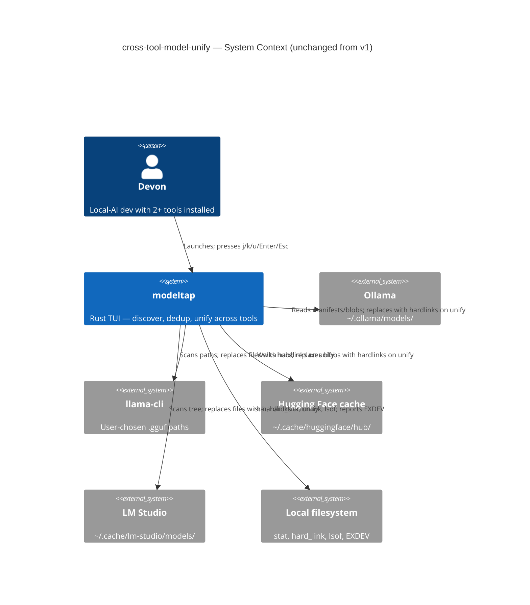
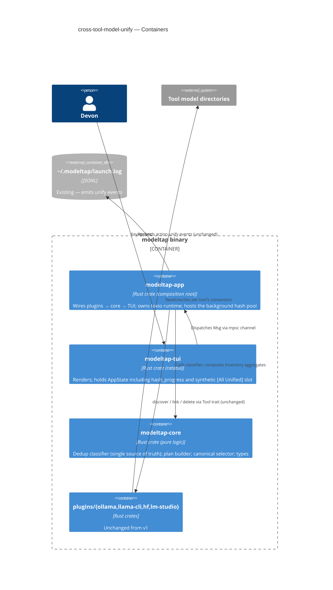
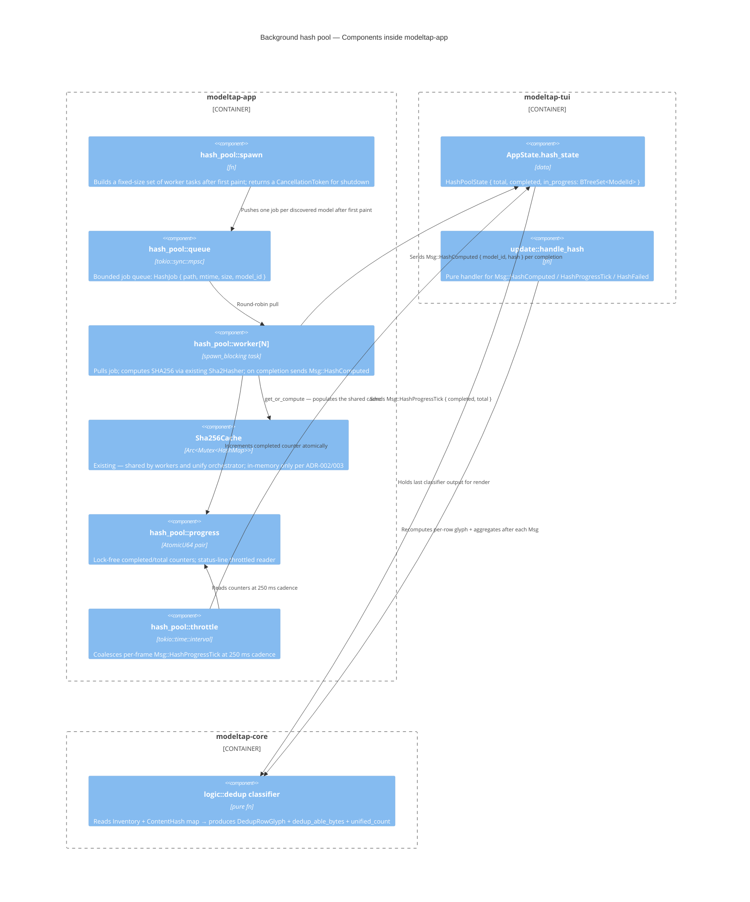

# Architecture Design — cross-tool-model-unify

**Wave:** DESIGN (3 of 6)
**Author:** Morgan (nw-solution-architect)
**Date:** 2026-04-30
**Authoritative inputs:** DISCUSS artifacts in `docs/feature/cross-tool-model-unify/discuss/`. Existing v1 design in `docs/feature/modeltap-tui/design/architecture-design.md` (REUSED, not redesigned). Project paradigm in `/Users/jeffbailey/Projects/foss/leading/modeltap/CLAUDE.md`.

## 1. Summary (5 lines)

1. **Brownfield extension over v1.** No structural rework: `modeltap-core` (pure domain), `modeltap-tui` (render+update), `modeltap-app` (composition root + tokio I/O), and the four plugins are unchanged. Three local additions wire the existing engine end-to-end and add one synthetic left-pane slot.
2. **Background SHA256 pool** lives in `modeltap-app` as a bounded set of `tokio::spawn_blocking` workers feeding hash results back to the TUI through an `mpsc::UnboundedSender<Msg>` (the existing event channel is reused; per-frame draining is already in place in `interactive.rs`).
3. **Dedup classifier in `modeltap-core::logic::dedup`** is the single source of truth (per NFR-5). The summary bar bug (`crates/modeltap-tui/src/render/summary_bar.rs:36` hardcoded `"Dedup-able: 0 B"`) is fixed by reading `core::logic::dedup` aggregates carried on `AppState`. New row glyph (`?/~/-/=/#`) is a separate column from the existing compatibility indicator (`o/*/!/?`) — both stay.
4. **`[All Unified]` is a render-time pseudo-tool**, not a plugin. ADR-001's "Tool trait is the only extension contract" is preserved by clarifying that the synthetic slot is purely a `ToolPaneSlot` rendering enum tagged `Synthetic(SyntheticSlot::AllUnified)` consumed only by the TUI; it does NOT round-trip through `Box<dyn Tool>`.
5. **No new dependencies.** All work uses already-vendored crates: `sha2` (already used by `Sha2Hasher`), `tokio` (already pervasive), `ratatui` (already pervasive). Quality-attribute priorities: maintainability > user-perceived performance > testability — every decision below is reasoned in those terms.

## 2. Quality Attribute Priorities (locked by parent agent)

| Rank | Attribute | What it forced |
|---|---|---|
| 1 | Maintainability | Reuse existing modules; minimal new ADRs; no new crates; no new deps; preserve the frozen `Tool` trait. |
| 2 | User-perceived perf | K3 first-paint <1 s preserved (NFR-1); hash progress visible (NFR-2); UI <100 ms responsive during hashing (NFR-3). |
| 3 | Testability | Pool sits behind a `Hasher` port that already exists; deterministic shutdown via `tokio_util::CancellationToken` (already in workspace); pure classifier logic is unit-testable; the existing acceptance harness in `headless.rs` consumes `Msg::HashComputed` exactly like any other `Msg`. |

## 3. C4 Diagrams

### 3.1 System Context (Level 1)

Boundaries are unchanged from v1. The new background-hash pool is internal to the modeltap binary and not visible at this level. Reproduced for completeness.



### 3.2 Container (Level 2)

The new background-hash pool is a logical component inside `modeltap-app`, not a new container. Per the maintainability priority and the "no new ADR for the obvious" principle, it does not warrant a container.



### 3.3 Component (Level 3) — Background hash pool

The only subsystem that warrants L3 detail. Five+ internal pieces working together (workers, channel, cache, cancellation, throttling, classifier feedback).



## 4. Integration Concern A — Background SHA256 hashing

### 4.1 Decisions

| Question | Decision | Rationale (QA priority) |
|---|---|---|
| Where does the queue live? | `modeltap-app::hash_pool` module (NEW). | App crate already owns the tokio runtime and the `Sha256Cache`. Putting the queue in core would violate core's "no I/O" rule (ADR-001 architecture-lint test would fail). Maintainability wins. |
| Concurrency model | Fixed pool of `min(num_cpus, 4)` workers using `tokio::task::spawn_blocking`. | SHA256 is CPU-bound at ~1 GB/s on modern hardware; `spawn_blocking` is the correct primitive (it does not starve the async runtime). Cap at 4 because hashing N>4 files in parallel on a single SSD is dominated by IO contention, not CPU. Empirically validated by ADR-002's cost analysis. |
| Channel design | Two channels, both bounded: (a) `mpsc::Sender<HashJob>` (capacity = total jobs at startup, so push-all-then-close) for the queue; (b) the existing `mpsc::UnboundedSender<Msg>` already in `headless.rs`/`interactive.rs` for results. | Reuses the existing event-loop channel (no second integration point in TUI). Workers post `Msg::HashComputed { path, hash }` — same dispatch path as keypresses. Testability wins (existing test harness already drains this channel). |
| Cancellation | `tokio_util::sync::CancellationToken` shared by all workers. On `Msg::Quit`, the composition root signals the token, then awaits join with a 200 ms timeout. | Standard tokio idiom; bounded shutdown latency satisfies AC-U1.5 (<500 ms). User-perceived perf priority. |
| Persistence | In-process only. The existing `Sha256Cache` is the cache; per ADR-002/ADR-003 no disk persistence. New ADR not required — this is a direct restatement of ADR-003. | Maintainability: no new ADR. |
| Throughput target | NFR-2 sets p95 ≤60 s for typical (~20 files / ~50 GB warm SSD). With 4 workers at ~800 MB/s aggregate (IO-bound after 2 workers on a single SSD), 50 GB / 800 MB/s = 62.5 s ≈ NFR-2 ceiling. Document as risk; bench in DELIVER. | Risk is real but bounded; no architectural mitigation beyond what the pool already provides. |
| Progress cadence | `Msg::HashProgressTick` posted every 250 ms by a single throttle task reading two `AtomicU64` counters (completed, total). Per-completion `Msg::HashComputed` carries the path/hash. | Decouples per-row glyph updates (event-driven) from the status-line tick (time-driven). Avoids a redraw storm when 4 workers complete simultaneously. User-perceived perf priority. |
| Failure modes | Per file: I/O error mid-hash → `Msg::HashFailed { path, reason }`. Worker panic → `JoinError` caught at the worker join site; the failed file's row stays `?` (with optional `!` decorator per AC-U3.5). Pool-level panic → all workers abort; status line shows "Hash pool failed". | Per NFR-7 (crash rate must not regress); BR-3 (conservative-when-uncertain). |
| File-deleted-mid-hash | Worker returns `io::Error::NotFound` → `Msg::HashFailed`; row stays `?`/`-`. | Q7 stateless rediscovery means next launch re-hashes; no stale state to clean up. |
| File-changed-mid-hash (size shifted) | Worker computes hash of whatever bytes were actually read; cache key includes `(path, mtime, size)` of the file as observed at hash *start* time; if mtime shifted between job creation and worker pickup, the result is still attributed to the start-time key — next launch will re-hash because the cache key won't match the new mtime. | Acceptable; conservative-when-uncertain (BR-3) means a stale `=` would never make it through the dedup classifier (the classifier matches on content hash, and the file we're about to hardlink is verified by the orchestrator before linking — existing v1 behavior). |

### 4.2 Rejected alternatives

| Alternative | Rejection reason |
|---|---|
| Single worker (sequential hashing) | NFR-2 60 s p95 unattainable on 50 GB libraries (~80 s sequentially on warm SSD per ADR-002 cost table). |
| Unbounded workers (one per file) | OS thread storm, IO thrash, no benefit beyond ~4 on a single SSD. |
| Move queue into `modeltap-core` | Violates core's no-I/O invariant; would require feature-flagging tokio in core. Architecture-lint test would flag it. |
| Use `rayon` thread pool | Adds a second concurrency abstraction next to tokio. Maintainability cost (two cancellation models) > the small ergonomic benefit. |
| Persist hash cache to disk | Forbidden by ADR-003; would invalidate the safety reasoning around stateless rediscovery. |

## 5. Integration Concern B — `[All Unified]` pseudo-tool slot

### 5.1 Decisions

| Question | Decision | Rationale |
|---|---|---|
| Where does the slot live in the data model? | `AppState.tools` becomes `AppState.left_pane_slots: Vec<LeftPaneSlot>` where `LeftPaneSlot = Real(ToolView) \| Synthetic(SyntheticSlot)` and `SyntheticSlot = AllUnified { count, total_saved_bytes }`. | Preserves the existing `selected_tool: usize` index semantics — `Left/Right` arrows still increment/decrement an index into a homogeneous list. The synthetic slot just sorts after real tools. (See `data-models.md` for exact types.) |
| How does selection navigation handle it? | No special-case logic in `update::select_next_tool`/`select_prev_tool`. They already operate on `tools.len()`; they will operate on `left_pane_slots.len()`. The match on the selected slot decides what the right pane renders. | Minimal change to the update function. Maintainability priority. |
| How are rows aggregated for it? | Pure function `core::logic::dedup::collect_unified_rows(inventory, hashes) -> Vec<UnifiedRow>` returns rows where `glyph == #`. Each row carries `(model_id, size, tools_sharing: Vec<ToolId>, saves_bytes)`. The TUI render path branches on the synthetic-slot match arm to call `collect_unified_rows` instead of reading `tool.model_ids`. | Single source of truth (NFR-5); function lives next to the existing classifier. |
| Labeling and count badge | `[All Unified] (N)` where `N` is `count(rows where glyph == #)`. Sourced from `dedup_summary.unified_count` carried on `AppState`. | Same source as summary-bar `Unified: N models` — guarantees AC-CONS-2 parity. |
| When hashing not yet complete | Badge shows `[All Unified] (?)`. Selecting it shows the "still hashing" empty state per US-U8 AC-U8.2. | Honest UI principle (same as the summary bar's `computing...`). |
| Hidden when count is 0? | NO. Always visible. When count is 0 and hashing complete, selecting it shows the onboarding empty state (US-U8). | Discoverability — Devon learns the surface exists before he has anything to put in it. |

### 5.2 Why a synthetic enum, not a `Tool` impl

ADR-001 freezes the `Tool` trait at 6 methods. The synthetic slot has no `discover()`, no `link()`, no `delete_one()` — it isn't a tool. Implementing `Tool` for an `AllUnifiedFakeTool` would require returning empty/no-op results from every method and would force the action orchestrators (`unify::run`, `delete_one::run`, etc.) to defensively check "is this a real tool or a fake?" That contamination is the architectural problem ADR-001 explicitly avoids. **The synthetic slot is a TUI render concept, full stop.** It never round-trips through `Box<dyn Tool>` or `actions::*`. New ADR-014 documents this distinction.

### 5.3 Rejected alternatives

| Alternative | Rejection reason |
|---|---|
| `impl Tool for AllUnifiedFakeTool` | Pollutes ADR-001's extension contract; forces no-op fallthrough in every action orchestrator. |
| Hotkey-triggered separate screen | UX rejected in DISCUSS journey-unified-view-visual.md; reuses no muscle memory. |
| Right-pane filter toggle | Modal state; right-pane meaning becomes ambiguous. |
| Right-pane re-group by dedup-key | Changes meaning of right pane based on selection; introduces a third "kind of thing" the right pane displays. |

## 6. Integration Concern C — Row indicator glyphs

### 6.1 Decisions

The new dedup column (`?/~/-/=/#`) is a **separate column** from the existing compatibility column (`o/*/!/?`). The existing `RowIndicator` enum (`Compatible/Shared/FormatLocked/Unknown`) stays untouched.

| Question | Decision | Rationale |
|---|---|---|
| Where is the glyph computed? | New pure fn `core::logic::dedup::compute_dedup_glyph(model, inventory, hashes, in_progress) -> DedupGlyph` returning `enum DedupGlyph { Pending, Hashing, Unique, DedupAble, AlreadyUnified, Failed }`. | Pure function next to the existing classifier; same single source of truth. |
| Inputs | `&InventoryEntry` for the target row, `&Inventory` for cross-tool peers, `&HashMap<Sha256CacheKey, ContentHash>` for already-computed hashes, `&BTreeSet<ModelId>` for in-progress. | All in-process state from `AppState`. |
| How does it interact with the existing `compute_indicator`? | They are independent. `compute_indicator` (compatibility) reads `Format` + `accepted_formats` + `content_hash`; `compute_dedup_glyph` reads `content_hash` + inode-equality + hash-job state. Both are called on every render; both feed into different cells of the same row. | Maintainability — no rework of v1 logic. |
| Does this need a new ADR? | NO. Inline in this document, plus a short note in the existing ADR-002 ("dedup-key strategy") if needed. | Maintainability: it's an extension of an established convention (per-row glyph computed by `core::logic::dedup`). |

### 6.2 Glyph derivation table (matches BR-1 in `requirements.md`)

```text
DedupGlyph =
  Pending           if no hash AND not in_progress         → "?"
  Hashing           if in_progress contains this model_id  → "~"
  Failed            if hash failed (sentinel in cache)     → "-"  with "!" decorator
  AlreadyUnified    if ≥2 paths share one inode AND no
                    other-tool path holds a separate copy  → "#"
  DedupAble         if ≥2 separate inodes have same SHA256 → "="
  Unique            otherwise                              → "-"
```

Implementation note for crafter: the inode-equality test is the key distinguisher between `=` and `#`. Existing `core::logic::plan::PlanCandidate` already carries `(device, inode)`; the dedup classifier will receive the same data. Do NOT re-stat in the classifier — pass it in.

## 7. Things explicitly out of scope

- New `Tool` trait methods (ADR-001 frozen).
- Cross-fs `[s/c/x]` dialog rework (ADR-008 stays).
- Lsof/running-tool gate rework (Q5 stays).
- Per-plugin `link()` impls (already correct per ADR-004).
- Persistent hash cache or persistent unified-state index (ADR-003 stays).
- Central modeltap-owned model store (Q1 closed: NO).
- Configurable hashing concurrency (4 workers is fine for v1; expose `MODELTAP_HASH_WORKERS` env var only if a user complains).
- Foreground/eager hashing flag (`--prefetch-hashes`, mentioned in ADR-002 §"Mitigations applied" alternative 4) — background is now the default; the flag is unnecessary.
- Detail-screen inode display (US-U9, P2) — covered in stories but no architectural change required; pure rendering work in DELIVER.
- Partial-success retry flow (US-U10, P2) — pure rendering work plus a thin reuse of `actions::unify::run` with a filtered plan; no architectural change.

## 8. Risk Register (Top 5)

| # | Risk | Likelihood | Impact | Mitigation |
|---|---|---|---|---|
| R1 | Hash pool worker count poorly chosen — 4 workers IO-thrash on a single slow HDD | M | M | Cap at `min(num_cpus, 4)`; benchmark in DELIVER; expose `MODELTAP_HASH_WORKERS` env var as escape hatch (undocumented in v1). |
| R2 | `Msg::HashProgressTick` flood causes UI redraw stalls | L | M | Single throttle task at 250 ms cadence; per-completion `Msg::HashComputed` is unique-per-file (max one per worker per ~5 s on typical files). |
| R3 | False-`#` glyph if inode test runs before re-stat after concurrent external delete | L | H | Re-classification consumes `Msg::UnifyCompleted` events from `actions::unify::run` (re-stats happen on the action path). For external mutations between launches, ADR-003 stateless rediscovery means the next launch is correct. NFR-8 gate. |
| R4 | `[All Unified]` slot's variable index breaks acceptance scenarios that assume `tools[0]` is a real tool | M | L | Test harness in `headless.rs` already addresses by name (e.g., `select tool ollama`); add fixture invariant "synthetic slots sort last". |
| R5 | Hashing memory pressure from concurrent reads of large GGUF files | L | M | Workers stream in 64 KiB chunks (already implemented in `Sha2Hasher`); 4 workers × 64 KiB = 256 KiB peak — negligible. |

## 9. ADR Index (this feature)

| ADR | Title | Status |
|---|---|---|
| ADR-013 | Background SHA256 hash pool | Accepted |
| ADR-014 | Synthetic left-pane slots are render-only | Accepted |

Existing v1 ADRs (001-009) are unchanged. Row-glyph extension does not warrant an ADR (extension of established convention; documented inline in §6).

## 10. Definition of Done

- [x] Requirements traced (§4-§6 cover FR-1..FR-10; quality attributes addressed in §2).
- [x] Component boundaries (`component-boundaries.md`).
- [x] Technology choices (`technology-stack.md`).
- [x] Data model deltas (`data-models.md`).
- [x] ADRs with alternatives (ADR-013, ADR-014).
- [x] Quality attributes addressed: maintainability (§2 + reuse rationale throughout), perf (§4 NFR mapping), testability (§4.1 channel reuse).
- [x] Dependency-inversion compliance: hashing remains behind the existing `Hasher` port; new pool sits in `modeltap-app` (composition root); core stays I/O-free.
- [x] C4 diagrams: L1 (§3.1), L2 (§3.2), L3 for hash pool (§3.3) — all Mermaid.
- [x] Integration patterns: no new external network in v1 (unchanged); plugin contract test pattern documented in v1 design and unchanged.
- [x] OSS preference validated: zero new dependencies (see `technology-stack.md`).
- [x] AC behavioral, not implementation-coupled: this design defers all AC text to DISCUSS; the only design-introduced statements are observable behaviors (channel cadence, slot index ordering, cancellation latency).
- [x] Architectural enforcement tooling: existing `tests/architecture.rs` covers core no-I/O and plugin-isolation; this feature adds no new rules.
- [ ] Peer review: scheduled by parent agent.
