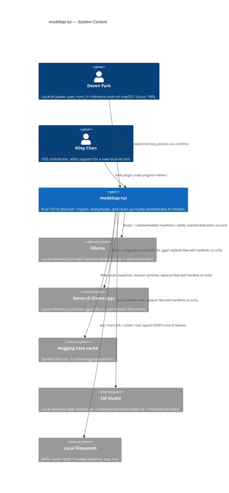
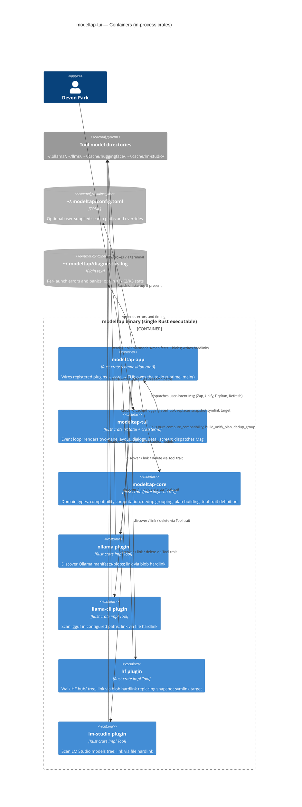
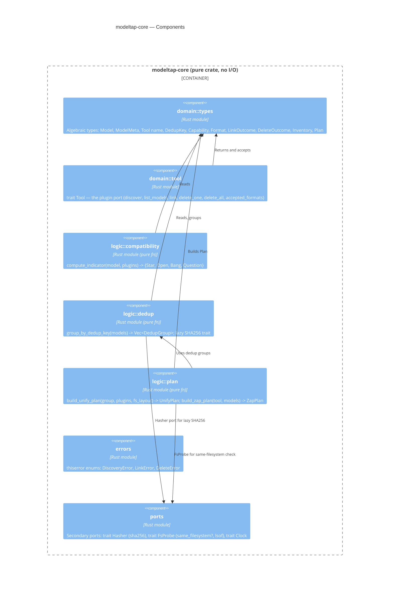
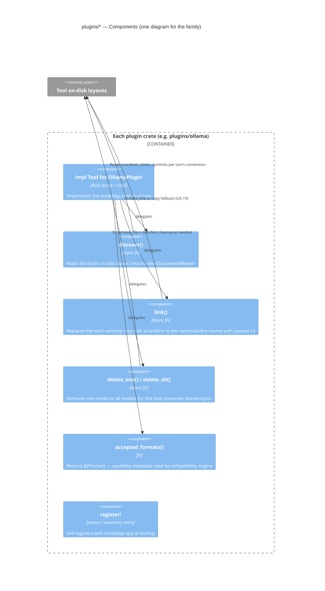

# Architecture Design — modeltap-tui

**Wave:** DESIGN (3 of 6)
**Author:** Morgan (nw-solution-architect)
**Date:** 2026-04-28
**Authoritative inputs:** `docs/feature/modeltap-tui/intake-brief.md` (overrides DISCUSS where they conflict), DISCUSS artifacts under `docs/feature/modeltap-tui/discuss/`.

## 1. Architecture Summary (5 lines)

1. **Components:** `modeltap-core` (pure domain), `modeltap-tui` (ratatui render+event loop), `modeltap-app` (composition root), `plugins/{ollama,llama-cli,hf,lm-studio}` (each a separate crate implementing the `Tool` trait), `modeltap-cli` (optional v2 scripting entrypoint, seam left open in v1).
2. **Dispatch model:** dynamic dispatch via `Box<dyn Tool>` in a `Vec` registered at `modeltap-app::main()`. Static inventory at startup; no runtime cdylib loading in v1.
3. **State model:** stateless rediscovery on every launch. No `~/.modeltap/index.json`. SHA256 dedup keys cached in-process only (per session). Tool directories are the single source of truth.
4. **Key dependencies:** ratatui + crossterm (TUI), tokio (async I/O for parallel discovery), thiserror (domain errors), anyhow (edge errors), sha2 (content hashing), serde + toml (config file), dirs (cross-platform paths), tracing (structured logging), inventory or static slice for plugin registration.
5. **Style:** modular monolith with hexagonal seams. Domain in `modeltap-core` depends on nothing concrete; plugins implement `Tool` (a port); `modeltap-tui` consumes `modeltap-core` types and dispatches user intent through `modeltap-app`.

## 2. Quality Attribute Priorities

Derived from DISCUSS NFRs and KPIs (intake-brief priorities re-affirmed):

| Rank | Attribute | Drivers |
|---|---|---|
| 1 | **Safety** | K5 zero accidental loss, US-05 typed confirm, US-14 dry-run, US-19 cross-fs, partial-state recovery. |
| 2 | **Maintainability / extensibility** | C1 plugin trait, US-18 5th-tool-zero-core-changes, K4 community plugin within 6 months. |
| 3 | **Responsiveness** | K3 < 1 s first paint. Critically harder under stateless model: no cached index. |
| 4 | **Testability** | DELIVER will use Outside-In TDD. Hexagonal seams + pure core + trait-mocked plugins are the design's test surface. |
| 5 | **Cross-platform portability** | macOS + Linux + WSL identical code paths. `dirs` crate handles homes/caches. |

Deprioritized: scalability (single-user local), distributed fault tolerance (no network), security beyond filesystem permissions (no auth, no secrets).

## 3. Conway's Law Check

Solo developer, single repo, single binary. **One team, one boundary.** The "external team" is open-source contributors who add new tool plugins (US-18, Riley persona). The cross-team interface is the `Tool` trait — treated as a **public API contract**. SemVer applies: breaking trait changes = major-version bump.

## 4. C4 Diagrams

### 4.1 System Context (Level 1)



### 4.2 Container (Level 2)



### 4.3 Component (Level 3) — modeltap-core



### 4.4 Component (Level 3) — modeltap-plugins



## 5. Component Boundaries

See `component-boundaries.md` for the detailed boundary spec and dependency rules. Summary:

- `modeltap-core` is the inner layer. It depends on **nothing concrete** — only `std` and small leaf crates (`thiserror`, `serde` for type derives). It defines `trait Tool` and all algebraic types.
- Each plugin crate depends on `modeltap-core` only. Plugin crates **must not depend on each other** and **must not depend on `modeltap-app` or `modeltap-tui`**.
- `modeltap-tui` depends on `modeltap-core` (for types) and on `ratatui` + `crossterm`. It does not know about specific plugins. It dispatches user intent to `modeltap-app` via a `Msg` channel.
- `modeltap-app` is the composition root. It depends on `modeltap-core`, every plugin crate (concrete imports for registration), `modeltap-tui`, and `tokio`.
- `modeltap-cli` (optional v1, definite v2) depends on `modeltap-core`, every plugin crate, and `modeltap-app` (sans TUI).

Architecture rules to be enforced via `cargo-deny` + a `dependency-cruiser`-equivalent check (see ADR-006). For Rust the simplest mechanism is `cargo-modules` graph + a workspace-level lint script in CI; alternatively `cargo-machete` for unused-dep checks. A custom CI check using `cargo metadata` JSON is straightforward.

## 6. Tool Trait (the Plugin Port)

```rust
// In modeltap-core::domain::tool

#[async_trait::async_trait]
pub trait Tool: Send + Sync {
    /// Stable identifier shown in the left pane and used in CLI args.
    fn name(&self) -> &'static str;

    /// Capability metadata used by compatibility engine to decide o/*/!.
    fn accepted_formats(&self) -> &'static [Format];

    /// Walk the tool's on-disk layout. Pure I/O; no mutation.
    /// Returns DiscoveredModel entries (not yet hashed; SHA256 is lazy).
    async fn discover(&self, ctx: &DiscoveryCtx) -> Result<Vec<DiscoveredModel>, DiscoveryError>;

    /// Replace the tool's current copy of `model` with a hardlink to `canonical_src`.
    /// Plugin owns: how to update the tool's manifest/registry/config so that
    /// the tool can still load this model after the file is replaced.
    async fn link(
        &self,
        canonical_src: &Path,
        model: &ModelMeta,
        ctx: &LinkCtx,
    ) -> Result<LinkOutcome, LinkError>;

    /// Delete a single model from this tool (manifest entry + file if unique).
    async fn delete_one(
        &self,
        model: &ModelMeta,
        ctx: &DeleteCtx,
    ) -> Result<DeleteOutcome, DeleteError>;

    /// Delete every model for this tool (manifest entries + files).
    /// Implementations may delegate to delete_one in a loop.
    async fn delete_all(
        &self,
        ctx: &DeleteCtx,
    ) -> Result<Vec<DeleteOutcome>, DeleteError>;
}
```

The trait is `async_trait`-decorated for v1 (Rust async-in-trait stable as of 1.75 is usable but `async_trait` keeps trait objects working without poll-pinning gymnastics). Decision rationale: ADR-001.

`DiscoveryCtx`, `LinkCtx`, `DeleteCtx` carry shared services (the SHA256 hasher port, the fs-probe port, a tracing span, a cancellation token). This keeps the trait surface clean and lets the app inject test doubles for unit testing plugins.

**`link()` semantics (Q2 closure attempt):** the modeltap-app passes in `canonical_src` — the path that should become the canonical inode. The plugin's job is to (a) verify same-filesystem with the target (or surface EXDEV), (b) atomically replace the existing copy with a hardlink to `canonical_src`, and (c) update the tool's manifest/registry so that the next time the tool starts it sees the same model at the same identity. See ADR-004 for the per-tool linking spec status.

**Single-model delete (F4 delta):** the trait already exposes `delete_one`. This is the hook for the **NEW** requirement from intake-brief that DISCUSS US-05 does not currently capture. Flag for back-edit: see Section 11.

## 7. Stateless Discovery and the K3 Budget

**Decision:** stateless rediscovery on every launch (per Q7 intake override). No persistent index file.

**K3 implication:** < 1 s first paint becomes a hard performance constraint, not a target. Strategy:

1. **Render the skeleton immediately.** The two-pane layout renders with tool names from the registered plugin list (known at compile time) before any disk I/O completes. First paint = layout + "discovering..." rows. This satisfies < 1 s trivially.
2. **Parallel async discovery.** `app::main` spawns one tokio task per plugin's `discover()`. Tasks complete independently; the TUI swaps "discovering..." rows for real rows as each plugin reports. This satisfies the < 3 s full-inventory NFR for ≤ 500 models.
3. **Lazy SHA256.** Discovery returns `DiscoveredModel { path, size, format, sha256: None }`. SHA256 is computed on demand (when the user opens a detail screen or initiates a unify) — never on the first-paint path. ADR-002 details cost analysis.
4. **No per-launch full-tree filesystem stat storms.** Each plugin uses targeted reads (e.g., Ollama plugin reads only the manifest tree, not every blob; HF plugin reads `models--*/snapshots/*` directories, not the entire cache). Discovery is O(N models), not O(N bytes).

**Budget allocation (target):**

| Phase | Budget | Notes |
|---|---|---|
| Process start → ratatui::init() | 50 ms | Crate startup overhead |
| ratatui::init() → first paint with skeleton | 100 ms | Pure layout, no I/O |
| First paint → all 4 plugins reported discover() | 800 ms | Parallel, dominated by slowest plugin (HF cache walk on a populated machine) |
| All discovery done → indicator (o/*/!) computed and rendered | 200 ms | Pure computation in `modeltap-core::logic::compatibility` |
| **Total to "fully populated, indicators rendered"** | **~1.15 s** | **Well within 3 s NFR.** First paint ≤ 150 ms is well within < 1 s. |

## 8. Quality Attribute Strategies

### 8.1 Safety (rank 1)

- Typed-name confirmation for zap (US-05 AC).
- Dry-run (US-14) is the default-recommended motion for unify; modeltap shows the same plan in both dry-run and real-run views — same code path, same `Plan` value.
- `delete_one` and `delete_all` are separate trait methods; UI cannot accidentally invoke `delete_all` from a single-model-selected context (no implicit fan-out).
- Filesystem operations are sequenced as: (1) verify same-fs (or fall back per US-19), (2) create canonical hardlink at sibling path, (3) `rename` over the existing path (atomic on POSIX), (4) update manifest. Steps 1-3 are safe to roll back if step 4 fails. ADR-008 covers cross-fs.
- Plugin panic isolation: every plugin call is wrapped in `tokio::task::spawn` + `JoinHandle`; a panic surfaces as `JoinError` and that tool shows `(error)` while the rest of the app continues (US-18 AC-4).

### 8.2 Maintainability / extensibility (rank 2)

- Plugin port is a single small trait (Section 6). 6 methods. Documented in `CONTRIBUTING.md` (to be authored in DELIVER) with a worked example.
- Static plugin registration via the `inventory` crate (or a hand-rolled `static PLUGINS: &[fn() -> Box<dyn Tool>]` slice). New plugin = add one line to a registry file in `modeltap-app`. The intake brief's "zero core changes" is interpreted strictly as "zero changes to `modeltap-core/`" — adding one line to `modeltap-app/src/registry.rs` is acceptable. Alternatively `inventory::collect!` allows zero changes anywhere outside the plugin crate. ADR-001 makes this concrete.
- Architecture rules enforced by CI: a workspace-level test in `tests/architecture.rs` parses `cargo metadata --format-version 1` JSON and asserts (a) `modeltap-core` has no path-deps on plugins, (b) plugins do not depend on each other, (c) `modeltap-tui` does not import any concrete plugin. See ADR-001 enforcement section.

### 8.3 Responsiveness (rank 3)

Covered in Section 7.

### 8.4 Testability (rank 4)

Hexagonal seams:

- **Acceptance tests** through `modeltap-app` with in-memory test plugins implementing `trait Tool`. The composition root accepts a `Vec<Box<dyn Tool>>` so tests can substitute everything.
- **Unit tests** against `modeltap-core` pure functions (`compute_indicator`, `group_by_dedup_key`, `build_unify_plan`). No mocks needed; pure inputs and outputs.
- **Plugin contract tests** in `modeltap-core/tests/plugin_contract.rs` parameterized over `T: Tool`. Each plugin crate runs the contract test against itself with fixture directories under `plugins/<name>/tests/fixtures/`.
- **TUI tests** via `ratatui::backend::TestBackend` capturing rendered buffers as text snapshots (insta).

### 8.5 Cross-platform portability (rank 5)

- All path discovery routed through `dirs::home_dir()`, `dirs::cache_dir()`, plus `std::env::var("HF_HOME")` for HF.
- `cfg!(unix)` gates around `lsof` invocation; on Windows-without-lsof (i.e. no WSL), the running-tool detection returns `Unavailable` (US-17 AC).
- Hardlinks: `std::fs::hard_link` works identically on macOS APFS, Linux ext4/btrfs, WSL ext4. Cross-fs returns EXDEV uniformly.
- WSL-only Windows support: no separate code paths needed; WSL paths are Linux paths.

## 9. Integration Patterns

There are **no external network integrations in v1**. Every integration is filesystem-mediated against locally-installed tools' on-disk layouts. There are no APIs to contract-test against. No Pact, no consumer-driven contracts.

The architectural equivalent of a contract test for this design is the **plugin contract test** in Section 8.4 — a parameterized test that any `T: Tool` must pass. This is the boundary integrators care about.

If a future v2 adds a remote-registry plugin (e.g., "list models on a HF Spaces endpoint"), that plugin will introduce a network dependency and at that point a Pact-style contract test against the HF API becomes appropriate. Out of scope for v1.

## 10. Deployment / Distribution

Single statically-linked Rust binary built per (target_os, target_arch):

| Target | Binary |
|---|---|
| `x86_64-apple-darwin` | `modeltap` |
| `aarch64-apple-darwin` | `modeltap` |
| `x86_64-unknown-linux-gnu` | `modeltap` |
| `aarch64-unknown-linux-gnu` | `modeltap` |
| `x86_64-pc-windows-msvc` (WSL host build) | not distributed; users install via WSL Linux binary |

CI (DEVOPS wave will own concrete pipeline): GitHub Actions matrix on macOS-latest + ubuntu-latest. Cargo workspace builds; `cargo test --workspace` on both runners. Architecture lint test (Section 8.2) gates merge.

## 11. DISCUSS Back-Edits Required

Where DISCUSS conflicts with intake-brief, intake wins. The following DISCUSS artifacts need patching (DELIVER or a DISCUSS-correction iteration):

| # | DISCUSS file | Edit needed | Source |
|---|---|---|---|
| BE-1 | `requirements.md` Domain Glossary "canonical store" | Remove `~/.modeltap/store/`. Replace with: "modeltap does not own a central store. The 'canonical' file for a unified model is whichever existing tool-owned copy is selected as the source; other tools' copies become hardlinks pointing at it." | Q1 intake answer |
| BE-2 | `requirements.md` Open Questions Q1 row | Change resolution from `~/.modeltap/store/` to "no central store; tool directories are source of truth". | Q1 intake answer |
| BE-3 | `requirements.md` Open Questions Q5 row | Change "soft warning" to "detect-and-prompt-then-retry; user closes tool and retries" | Q5 intake answer |
| BE-4 | `requirements.md` Open Questions Q6 row | Change from DEFERRED to RESOLVED: SHA256 of file content (primary), HF repo+quant (display fallback). | Q6 intake answer |
| BE-5 | `requirements.md` Open Questions Q7 row | Change "PARTIAL: store yes, registry deferred" to RESOLVED: "stateless. No central store, no registry file. Rediscover on every launch." | Q7 intake answer |
| BE-6 | `requirements.md` Architectural Constraints | Remove the implicit `~/.modeltap/store/` references; add new constraint C7 "Stateless: no persistent index, no central store. Tool directories are source of truth." | Q1, Q7 intake answers |
| BE-7 | `user-stories.md` US-05 Solution + AC | Title remains "Zap a tool's models" but body must also describe single-model zap (delete one model from one tool). Either expand US-05 or add **US-05b: Zap a single model from one tool**. AC must add "delete-from-one is a separate confirmation modal" and "available from detail screen via [d]". | F4 intake update |
| BE-8 | `user-stories.md` US-10 Solution | Replace `~/.modeltap/store/` references with "the existing largest copy among current paths is chosen as canonical". US-10 dialog mockup shows path swap, not store copy. | Q1 intake answer |
| BE-9 | `journey-cleanup-and-unify-visual.md` Step 4a | Replace canonical-path mockup `/Users/devon/.modeltap/store/sha256-...` with whichever existing tool path is chosen as canonical (illustrate with "Ollama blob path becomes canonical; llama-cli .gguf becomes hardlink to it"). | Q1 intake answer |
| BE-10 | `requirements.md` Domain Glossary "dedup key" | Change from "OPEN (Q6)" to "SHA256 of file content (primary identity); HF repo+quant (display label only). Computed lazily." | Q6 intake answer |
| BE-11 | All artifacts | Find/replace examples of "Jan" as the 5th-tool example with "Atomic Chat". | intake cosmetic |
| BE-12 | `requirements.md` Q5 Risks row | Update concurrency risk mitigation to reflect detect-and-retry, not file-locking | Q5 intake answer |

These are **non-blocking for DESIGN**. DESIGN proceeds as if intake-brief is canonical; back-edits are flagged for the user to apply or for DELIVER to apply during story refinement.

## 12. Open Architecture Questions (punted)

These are deliberately deferred — calling them out so DELIVER doesn't get blindsided.

1. **OQ-1: HF cache linking mechanics.** The HF cache uses a snapshot-symlink-to-blob structure. Replacing the blob with a hardlink to a canonical chosen elsewhere is straightforward; replacing the snapshot symlink target is the question. Light spike needed in DELIVER (US-12 / US-10 build week). See ADR-004.
2. **OQ-2: LM Studio path conventions across versions.** Multiple defaults observed (`~/.cache/lm-studio/`, `~/.lmstudio/`). Plugin checks both; handling is straightforward. No architecture question, just a build-week verification.
3. **OQ-3: Ollama manifest-level vs blob-level link semantics.** Ollama's manifest can reference any blob hash; if we replace the blob file with a hardlink to a canonical and the canonical's content hash matches the blob name, Ollama will still find it. If the canonical was chosen from a non-Ollama path (e.g., the llama-cli `.gguf`), the file content is identical (same SHA256) — that's what dedup is — but Ollama's blob filename is `sha256-<hash>` and the hash must match. **Assumption to verify in spike:** Ollama's blob hash equals the file's SHA256 of the content bytes (it should, but verify). If yes, no additional work; if no, we need a wrapper or an Ollama-specific blob-format step.
4. **OQ-4: Cross-fs copy-fallback default policy.** US-19 lists three options (skip / copy / cancel). v1 default if user just presses Enter? My recommendation: refuse and surface the three options explicitly (no silent copy that wastes disk). Confirm with user during DELIVER.
5. **OQ-5: SHA256 cost on huge files.** A 50 GB GGUF takes ~30-60 s to hash on a fast SSD. Is the lazy-on-detail-screen UX acceptable, or do we need a background-prefetch? My v1 stance: lazy-with-progress-bar in the detail screen; document the cost. ADR-002 covers this; OQ is whether to revisit if users complain.

## 13. ADR Index

See `docs/adrs/`:

| ADR | Title | Status |
|---|---|---|
| ADR-001 | Plugin dispatch — dynamic in-process via Box<dyn Tool> | Accepted |
| ADR-002 | Dedup-key strategy — SHA256 primary, HF id secondary | Accepted |
| ADR-003 | State model — stateless rediscovery, no persistent index | Accepted |
| ADR-004 | Per-tool linking strategy (per-plugin spec status) | Partially Accepted |
| ADR-005 | Async runtime — tokio | Accepted |
| ADR-006 | TUI architecture — ratatui Elm-style update loop | Accepted |
| ADR-007 | Error model — thiserror in domain, anyhow at edges | Accepted |
| ADR-008 | Cross-filesystem fallback — refuse-default with per-target choice | Accepted |
| ADR-009 | Single-model delete — first-class trait method delete_one | Accepted |

## 14. Definition of Done (DESIGN wave)

- [x] Requirements traced to components (each US maps to a container in §4.2 and a component in §4.3).
- [x] Component boundaries with clear responsibilities (`component-boundaries.md`).
- [x] Technology choices in ADRs with alternatives (ADR-001 .. 009).
- [x] Quality attributes addressed (§8): safety, maintainability, responsiveness, testability, portability.
- [x] Dependency-inversion compliance: `modeltap-core` depends on nothing concrete; plugins depend only on core; app composes.
- [x] C4 diagrams: L1 (§4.1), L2 (§4.2), L3 for `modeltap-core` (§4.3) and plugins (§4.4) — Mermaid.
- [x] Integration patterns specified (§9 — local filesystem only; no external network in v1; plugin contract test pattern documented).
- [x] OSS preference validated: every dependency named in `technology-stack.md` is OSS with license recorded; no proprietary.
- [x] AC behavioral, not implementation-coupled: design defers to DISCUSS AC and adds no implementation-coupled AC of its own.
- [x] External integrations annotated with contract-test recommendation: §9 — none in v1; plugin contract tests are the analog.
- [x] Architectural enforcement tooling recommended: §8.2 — workspace-level architecture lint test, `cargo-deny` for licenses.
- [ ] Peer review: scheduled by parent agent; not Morgan's responsibility to invoke.
