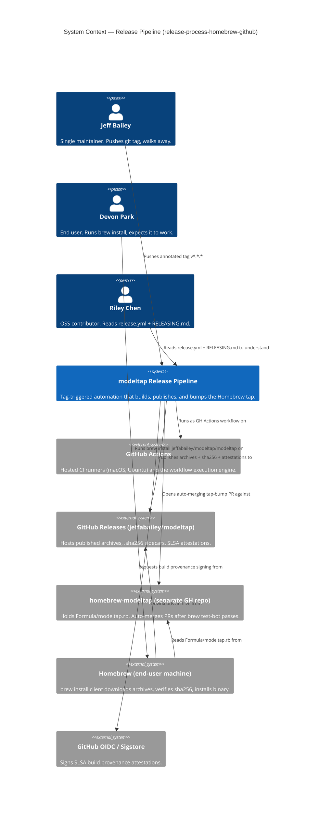
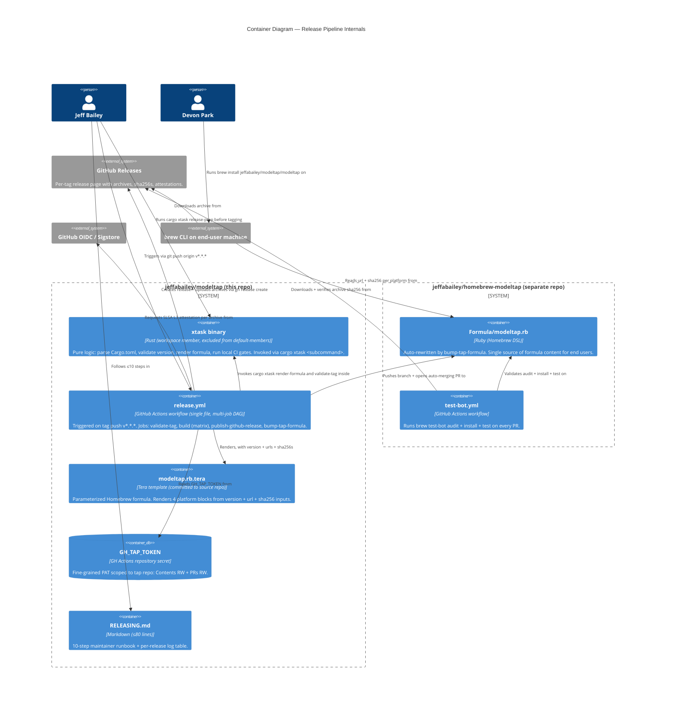

# Architecture Design — release-process-homebrew-github

**Wave:** DESIGN (3 of 6)
**Author:** Morgan (nw-solution-architect)
**Date:** 2026-05-03
**Authoritative inputs:** DISCUSS artifacts under `docs/feature/release-process-homebrew-github/discuss/`, project `CLAUDE.md`, existing `.github/workflows/ci.yml`, root `Cargo.toml`.

## 0. Pre-Wave Reading Checklist

- [x] `discuss/wave-decisions.md` — 8 decisions resolved (D1-D8); APPROVED by Eclipse 2026-05-03
- [x] `discuss/requirements.md` — 8 hard architectural constraints (C1-C8)
- [x] `discuss/acceptance-criteria.md` — 15 stories + 6 cross-story integration ACs
- [x] `discuss/user-stories.md` — 15 LeanUX stories with examples / UAT / AC
- [x] `discuss/story-map.md` — 3-slice structure: WS, R1, R2
- [x] `discuss/outcome-kpis.md` — K-T2T, K-PIPE, K-COVER, K-TOIL, K-PROV, K-CONTRIB
- [x] `discuss/journey-tag-to-brew-install-visual.md` — 5-step mental model
- [x] `discuss/shared-artifacts-registry.md` — 14 shared artifacts with sources & consumers
- [x] `.github/workflows/ci.yml` — toolchain pinning, action versions to mirror
- [x] `Cargo.toml` (root) — workspace.package.version = 0.1.0, license MIT OR Apache-2.0

## 1. Architecture Summary (5 lines)

1. **Components:** new `xtask` workspace member (Rust binary at repo root, excluded from default-members) holding pure version/changelog/template logic + thin shell-out adapters; `release.yml` (single workflow file, multi-job DAG) in `.github/workflows/`; tap repo `jeffabailey/homebrew-modeltap` (separate repo, thin manifest); end-user `brew install` path.
2. **Atomicity model:** GitHub Actions `needs:` DAG enforces all-or-nothing publishing — `publish-github-release` and `bump-tap-formula` are not invoked unless every preceding gate succeeds (C2 / US-08). No `if: always()` overrides.
3. **Single source of truth:** `Cargo.toml [workspace.package].version` is the only authored copy of `${version}`. The validate-tag job is the integrity gate; `clap`'s `CARGO_PKG_VERSION` makes the binary self-consistent (C1 / US-02).
4. **Cross-repo authentication:** fine-grained PAT (`GH_TAP_TOKEN`) scoped to the tap repo with `Contents: RW` + `Pull Requests: RW` only (D7).
5. **Style:** functional-core / imperative-shell. The `xtask` Rust code is pure-function-driven (parse Cargo.toml, validate version, render Tera template); `git`/`gh`/`cargo` shell-outs live at the edges. Mirrors the project's established paradigm (`CLAUDE.md`: "pure-functional in the domain core, async I/O at the edges").

## 2. Quality Attribute Priorities

Derived from DISCUSS NFRs and outcome KPIs:

| Rank | Attribute | Drivers |
|---|---|---|
| 1 | **Reliability / atomicity** | C2 atomic publish, K-PIPE ≥95%, US-08 all-or-nothing, integrity is non-negotiable for a release pipeline. |
| 2 | **Integrity / supply-chain trust** | C1 single-source-of-version-truth, C3 CI parity, C8 no silent skips, US-09 SLSA L3, K-PROV 100%. |
| 3 | **Maintainability / contributor legibility** | US-13 ≤10-step runbook, US-14 ≤250-line workflow, K-CONTRIB ("Riley reads it, gets it"). |
| 4 | **Performance (tag-to-tap latency)** | K-T2T median ≤15 min / p90 ≤25 min, US-15 SLA. The matrix is parallel; cache strategy is load-bearing. |
| 5 | **Cross-platform coverage** | K-COVER 100% across 4 targets; aarch64-linux is the riskiest cell. |

Deprioritized (deliberately):

- **Latest-and-greatest tooling**: stable Rust only (CLAUDE.md / C7); no nightly, no MSRV pinning beyond what `ci.yml` already does.
- **Speed at the cost of integrity**: faster cross-compile (e.g., skipping `cross` for a hand-rolled linker config that breaks more often) is rejected.
- **Custom orchestration**: no Argo, no Tekton, no homegrown Rust release CLI — GitHub Actions is the substrate the maintainer already trusts.

## 3. Conway's Law Check

**Team structure:** single maintainer (Jeff Bailey). One person, one repo, one tap repo. No team boundaries to respect.

**Implication:** the architecture should NOT introduce any cross-team coordination overhead. The cross-repo split (modeltap ↔ homebrew-modeltap) is a *Homebrew convention* (taps must be separate repos named `homebrew-*`), not a team-shaped boundary. The PAT mediates this seam in a way that requires no second human.

**Future evolution:** if a co-maintainer joins, the credential model migrates from PAT to GitHub App (D7 documents the path). No other architectural change is needed; the pipeline scales to N maintainers because the trigger is `git tag` push (no branch policy negotiation, no human merge conflict on the release line).

## 4. C4 Diagrams (Mermaid)

### 4.1 Level 1 — System Context

The "system" here is the release pipeline. The C4 conventions for actors and external systems still apply, even though our internal containers are mostly automation.



### 4.2 Level 2 — Container Diagram

The "containers" here are unusual: most are GitHub Actions jobs, plus a Rust binary and a Ruby formula file. They are still deployment units that own state (workflow secrets, working trees, repo contents) and communicate via well-defined seams (artifacts, PRs, releases).



### 4.3 Level 3 — Component Diagram (xtask)

The `xtask` binary is the only container with internal complexity worth diagramming. It has a clear functional-core / imperative-shell split that mirrors `modeltap-core` / plugins from the existing project. Workflow jobs are detailed in `component-boundaries.md` Section 3 instead.

```mermaid
C4Component
  title Component Diagram — xtask binary (functional core / imperative shell)

  Container_Boundary(xtask, "xtask binary") {
    Component(cli, "subcommand dispatcher", "clap derive", "Routes argv to release-prep, validate-tag, render-formula, lint-workflows, extract-changelog.")

    Component_Boundary(core, "Pure functional core (no I/O)") {
      Component(version_logic, "version logic", "fn parse_workspace_version(toml: &str) -> Result<Version>; fn assert_monotonic(current, proposed) -> Result<()>; fn assert_tag_matches(tag, version) -> Result<()>", "All version reasoning. No filesystem, no git.")
      Component(formula_render, "formula renderer", "fn render(template: &str, ctx: FormulaCtx) -> Result<String> using Tera", "Pure template substitution. Takes a struct, returns a string.")
      Component(changelog_extract, "changelog section extractor", "fn extract_section(changelog: &str, version: &Version) -> Result<String>", "Pulls the ## [X.Y.Z] section out of CHANGELOG.md text.")
      Component(workflow_lint, "workflow file lint", "fn lint(yaml_text: &str, max_lines: usize) -> Result<(), Vec<LintError>>", "Counts lines, checks every job has a # Purpose comment above.")
    }

    Component_Boundary(shell, "Imperative shell (I/O adapters)") {
      Component(git_adapter, "git adapter", "wraps git CLI", "is_clean_tree, current_tag, commits_since(tag) — all shell-out to git.")
      Component(cargo_adapter, "cargo adapter", "wraps cargo CLI", "fmt_check, clippy, test, set_version (via cargo_metadata + edit Cargo.toml).")
      Component(gh_adapter, "gh adapter", "wraps gh CLI", "release create, attestation verify, pr merge --auto. Used only in CI context.")
      Component(cliff_adapter, "git-cliff adapter", "wraps git-cliff CLI", "Generates changelog text from conventional commits range.")
      Component(fs_adapter, "filesystem adapter", "std::fs", "Read Cargo.toml, write CHANGELOG.md, read template, write rendered formula.")
    }
  }

  Rel(cli, version_logic, "delegates to")
  Rel(cli, formula_render, "delegates to")
  Rel(cli, changelog_extract, "delegates to")
  Rel(cli, workflow_lint, "delegates to")
  Rel(cli, git_adapter, "uses")
  Rel(cli, cargo_adapter, "uses")
  Rel(cli, gh_adapter, "uses")
  Rel(cli, cliff_adapter, "uses")
  Rel(cli, fs_adapter, "uses")
  Rel(version_logic, fs_adapter, "(via subcommand) reads Cargo.toml through")
  Rel(formula_render, fs_adapter, "(via subcommand) reads template through")
  Rel(changelog_extract, fs_adapter, "(via subcommand) reads CHANGELOG.md through")
```

The dotted arrows from core to fs_adapter are deliberately in parentheses: the core functions take strings as input and return strings as output. The CLI dispatcher reads files (via fs_adapter) and passes the strings to the core. This is the standard imperative-shell pattern: all I/O at the edges, all logic in pure functions.

## 5. Component Architecture (boundaries summary)

Authoritative file: `component-boundaries.md`. Summary:

| Component | Type | Responsibility | Owner |
|---|---|---|---|
| `xtask` binary | Rust workspace crate (root `xtask/`, excluded from default-members) | Pure version/changelog/template/lint logic + thin CLI shell-outs. Invoked by maintainer (release-prep) AND by release.yml jobs (validate-tag, render-formula). | Source repo |
| `release.yml` | GitHub Actions workflow file | Orchestrates the 4-job DAG: validate-tag → build (matrix×4) → publish-github-release → bump-tap-formula. ≤250 lines. | Source repo `.github/workflows/` |
| `modeltap.rb.tera` | Tera template | 4-platform-block parameterized Homebrew formula. Source-controlled in main repo, rendered into tap repo. | Source repo `release/templates/` |
| `Formula/modeltap.rb` | Generated Ruby (Homebrew DSL) | Single user-facing formula. Auto-rewritten per release. | Tap repo |
| `test-bot.yml` | GitHub Actions workflow | Runs `brew test-bot audit + install + test` on every PR to tap repo `main`. | Tap repo `.github/workflows/` |
| `RELEASING.md` | Markdown runbook | ≤10 numbered steps + release-log table. | Source repo root |
| `git-cliff.toml` | Configuration | Conventional-commit-section rules for changelog generation. | Source repo root |
| `GH_TAP_TOKEN` | GH Actions secret | Fine-grained PAT (Contents RW + PRs RW on tap repo only). | Source repo settings |

## 6. Technology Stack (summary)

Authoritative file: `technology-stack.md`. Headlines:

- **Toolchain**: stable Rust via `dtolnay/rust-toolchain@stable` (matches `ci.yml` exactly per C7).
- **Cross-compile (aarch64-linux)**: `cross` v0.2.5 (Docker-based, OSS, MIT/Apache-2.0). See ADR-012.
- **Changelog**: `git-cliff` v2.x via `orhun/git-cliff-action@v3` (OSS, MIT/Apache-2.0).
- **Templating**: `tera` v1 (Rust crate, MIT) inside the xtask. See ADR-014.
- **Build provenance**: `actions/attest-build-provenance@v2` (GitHub-maintained, MIT, SLSA L3).
- **Cache**: `Swatinem/rust-cache@v2` (matches `ci.yml`).
- **CLI**: `gh` (pre-installed on hosted runners); `git` (pre-installed).
- **No proprietary tools**. No paid services. Every dependency has an OSS license recorded in the technology-stack document.

## 7. Integration Patterns

### 7.1 Internal integration (within the source repo)

| Producer | Artifact | Consumer | Mechanism |
|---|---|---|---|
| `xtask release-prep` | mutated `Cargo.toml`, mutated `Cargo.lock`, appended `CHANGELOG.md` | maintainer's prep PR | filesystem |
| `validate-tag` job | success status | `build` matrix | Actions `needs:` DAG |
| `build` matrix (4 cells) | `modeltap-${version}-${target}.tar.gz` + `.sha256` artifacts | `publish-github-release` | Actions `actions/upload-artifact@v4` → `actions/download-artifact@v4` |
| `publish-github-release` | GitHub Release with attached archives | `bump-tap-formula` | `gh release view` (URL stability) |
| `xtask render-formula` (called from `bump-tap-formula`) | rendered `Formula/modeltap.rb` | tap repo branch | filesystem write inside the tap-repo checkout |

### 7.2 Cross-repo integration

The single cross-repo seam is `bump-tap-formula → tap repo`. This is the integration most likely to break (auth, branch state, network).

**Authentication**: `GH_TAP_TOKEN` (fine-grained PAT) injected as `${{ secrets.GH_TAP_TOKEN }}` into `actions/checkout@v4` and `gh` invocations. The token is scoped to the tap repo only; failure surfaces as HTTP 401 visibly (C8 / US-06.AC-7).

**Idempotency** (US-12): `bump-tap-formula` checks for an existing `bump/v${version}` branch via `gh pr list --head bump/v${version}`. If found, force-push-with-lease updates it; if not found, create new branch + open PR. The end state is the same: one PR per version.

**Auto-merge** (US-11): `gh pr merge --auto --squash` runs once after PR creation. GitHub holds the merge until required status checks pass; `brew test-bot` is the gate (set up as a tap-repo branch protection rule, documented in RELEASING.md as a one-time precondition).

### 7.3 External integrations requiring contract testing

This pipeline integrates with several external services. Per `nw-architecture-patterns/SKILL.md` § Contract Testing:

| Integration | Type | What we consume | Recommendation |
|---|---|---|---|
| GitHub Releases API | REST (via `gh release create`) | Release creation + asset upload | **Action-version pinning is the contract**. `gh` is GitHub's official CLI; major-version compat is GitHub's responsibility. We pin a specific `gh` version range only if breakage is observed. No Pact-style contract test. |
| `actions/attest-build-provenance@v2` | GH Action | SLSA L3 attestation signing | **Pin to exact major version `@v2`**. Verification (`gh attestation verify`) IS the contract test — runs in US-09 AC-4 in CI and is documented for end users. |
| `homebrew/test-bot` action | GH Action (in tap repo) | Formula audit + install + test | **`brew test-bot` IS the consumer-driven contract test**. It runs on every tap PR; the PR is held until it passes. This is the single most important contract gate in the entire pipeline. |
| GitHub OIDC token endpoint | Implicit, via `attest-build-provenance@v2` | Identity assertion for SLSA signing | Black-box; no contract surface we author. |

**Annotation for platform-architect (DEVOPS handoff)**:

```
External Integrations Requiring Contract-Style Verification:
- Homebrew formula DSL (consumed by `brew install` and `brew test-bot`):
  Already covered — `brew test-bot` runs in the tap-repo PR and is the canonical
  verification. Auto-merge is gated on its success (US-11 AC-3).
- SLSA attestation envelope (consumed by `gh attestation verify`):
  Already covered — `gh attestation verify` runs in CI per US-09 AC-4 and is
  documented for end users in README troubleshooting.
- GitHub Releases asset URL stability (consumed by Homebrew formula `url` field):
  Verified by `brew test-bot install` step in the tap-repo PR. Any URL change
  fails the test-bot before auto-merge fires.
- GitHub Actions API (`gh`, `actions/*`): pinned by major version in workflow
  files. Annual review recommended; not a contract-test concern.
```

There are no third-party REST/GraphQL APIs to write Pact contracts against. The "consumer-driven contract" pattern is realized in this design via `brew test-bot` (consumer = Homebrew users; provider = our release artifacts).

## 8. Quality Attribute Strategies

### 8.1 Reliability / atomicity (rank 1)

- **`needs:` DAG** is the entire mechanism. `publish-github-release: needs: [validate-tag, build]` means publish never runs unless every build matrix cell succeeded AND validate-tag succeeded. `bump-tap-formula: needs: publish-github-release` extends the chain. Pure workflow-graph property; no imperative "if any failed, skip" code.
- **No `if: always()` overrides** for publish or bump. Code review enforces; the workflow lint (US-14) can grep for forbidden patterns.
- **Idempotent retry** of `bump-tap-formula` (US-12) recovers from transient cross-repo failures (token expiry, network blips) without producing duplicate PRs.
- **Validate-tag as fail-fast gate** (US-02): mismatched tag fails within ~15 seconds, before any 5-minute build runs.

### 8.2 Integrity / supply-chain trust (rank 2)

- **Single-source `${version}`**: `clap`'s `#[command(version)]` reads `CARGO_PKG_VERSION` at compile time. The validate-tag job asserts `tag == "v" + workspace_version`. The render-formula step takes the version from the tag, not from a separate config. This closes the loop (C1).
- **CI parity gates run inside `release.yml`** before any `cargo build --release` (C3 / US-03). The same `dtolnay/rust-toolchain@stable` action and same flags as `ci.yml`.
- **SLSA L3 attestation per archive** via `actions/attest-build-provenance@v2` (US-09). Workflow declares `permissions: id-token: write, attestations: write`. End-user verification is `gh attestation verify <archive> --owner jeffabailey`.
- **sha256 read-not-recompute**: `bump-tap-formula` reads `.sha256` files from the build artifacts; never re-hashes the archive. Re-hashing would defeat the integrity check because a tampered archive would produce a "valid" sha256 that the formula would then trust.
- **No silent skips** (C8): every guard fails loudly. `attest-build-provenance` failure fails the build cell; missing CHANGELOG section fails publish; token failure fails bump.

### 8.3 Maintainability / contributor legibility (rank 3)

- **Workflow file ≤250 lines** (US-14), enforced by `cargo xtask lint-workflows` running in `ci.yml` (so drift in a future PR catches before merge). Composite actions can be extracted into `.github/actions/<name>/action.yml` if/when 250 lines becomes binding.
- **Every job has a `# Purpose:` one-sentence comment** immediately above its declaration. Lint enforces.
- **`RELEASING.md` ≤80 lines, ≤10 numbered steps** (US-13). Plain markdown, no fancy templating, lives at repo root.
- **`xtask` Rust code follows the project's existing functional-core / imperative-shell pattern**. Contributor who has read `modeltap-core` recognizes the shape immediately.
- **All external action versions pinned** (`@v2`, `@v3`, `@v4`) and enumerated in `technology-stack.md`.

### 8.4 Performance — tag-to-tap latency (rank 4)

K-T2T target: median ≤15 min, p90 ≤25 min. Budget breakdown:

| Phase | Budget | Notes |
|---|---|---|
| Tag push → Actions trigger | ≤30 s | GitHub-side webhook latency |
| `validate-tag` job | ≤30 s | Single checkout + `grep`/`cargo metadata` + string compare |
| `build` matrix (4 cells parallel) | ≤6 min | Slowest cell drives the matrix; aarch64-linux via `cross` is the slowest (~5 min). Cache via `Swatinem/rust-cache@v2` per target. |
| `publish-github-release` | ≤2 min | Download 4 artifacts (~50 MB total) + `gh release create` + attachment upload |
| `bump-tap-formula` | ≤2 min | Checkout tap repo + render + commit + push + `gh pr create` + `gh pr merge --auto` |
| `brew test-bot` (tap repo CI) | ≤5 min | macos-14 + macos-13 + ubuntu-22.04 install + test stanzas in parallel |
| Auto-merge fires | ≤30 s | After last status check goes green |
| **Total tag → tap merged** | **≤16 min worst-case path** | Comfortably inside ≤14 min median target with cache warm |

**Cache strategy**: `Swatinem/rust-cache@v2` keyed per (`target`, `Cargo.lock` hash). Shared with `ci.yml` cache where possible. First release post-feature-merge will be cold-cache (~25 min); subsequent releases warm-cache (~12 min).

### 8.5 Cross-platform coverage (rank 5)

Four targets, four runners (US-07):

| Target | Runner | Build mechanism |
|---|---|---|
| `aarch64-apple-darwin` | `macos-14` | Native (Apple Silicon runner) |
| `x86_64-apple-darwin` | `macos-13` | Native (Intel macOS runner) |
| `x86_64-unknown-linux-gnu` | `ubuntu-22.04` | Native |
| `aarch64-unknown-linux-gnu` | `ubuntu-22.04` | `cross` (Docker-based cross-compile) |

`fail-fast: false` on the matrix so a single failure does not cancel still-running cells (helpful for diagnosis). Atomicity is preserved by the `needs:` DAG independent of `fail-fast`.

aarch64-linux verification: `brew test-bot` runs install on `ubuntu-22.04` (x86_64 runner) but with QEMU user-space emulation for the aarch64 binary (Homebrew on Linux supports this for taps). Not a perfect aarch64-native test; ADR-012 documents the trade-off.

## 9. Deployment / Distribution

The pipeline IS the deployment mechanism. There is nothing to deploy beyond:

1. Merging the feature PR to `main`.
2. Creating the tap repo (`jeffabailey/homebrew-modeltap`) — manual one-time setup.
3. Setting up `GH_TAP_TOKEN` as a repository secret — manual one-time setup.
4. Setting up branch protection on the tap repo's `main` requiring `brew test-bot` — manual one-time setup (US-11.AC-2 / US-11.AC-5).

Steps 2-4 are documented in `RELEASING.md` "First-time setup" section (US-13.AC-4).

## 10. ADR Index

See `docs/adrs/`:

| ADR | Title | Status |
|---|---|---|
| ADR-010 | Release pipeline architecture — single workflow file, multi-job DAG | Proposed |
| ADR-011 | xtask placement — repo-root xtask/ excluded from default workspace | Proposed |
| ADR-012 | Cross-compile strategy — `cross` for aarch64-linux | Proposed |
| ADR-013 | Tap-repo credential — fine-grained PAT (GH_TAP_TOKEN) | Proposed |
| ADR-014 | Formula templating — Tera-in-xtask (Rust), not inline shell | Proposed |

## 11. Open Architecture Questions (deliberately deferred)

These are intentionally out of scope; flagged so DELIVER doesn't get blindsided.

1. **OQ-1: macOS notarization step shape.** D3 defers signing/notarization. The build job structure (per ADR-010) leaves a slot before the `tar.gz` step where a notarize step can be inserted later without restructuring. No work needed in v1.
2. **OQ-2: `homebrew-core` formula naming convention.** D8 defers homebrew-core submission. If we ever submit, the formula needs no `version "..."` line and the URL must follow `homebrew-core` conventions; revisit then.
3. **OQ-3: aarch64-linux native runner availability.** GitHub recently announced `ubuntu-22.04-arm` runners (in beta). When stable, ADR-012 will be revisited to drop `cross` in favor of native. Out of scope for v1.
4. **OQ-4: Bytewise reproducible builds.** SLSA L3 via `attest-build-provenance@v2` proves *who built it*, not *that anyone could rebuild it*. Bit-for-bit reproducible Rust builds are an open ecosystem problem (timestamps, codegen non-determinism). Not pursued for v1.
5. **OQ-5: Tap-bump conflict if maintainer hand-edits the tap.** US-12.AC-4 documents the trade-off ("fix the template, not the rendered file"). Not an architectural problem; a process discipline issue documented in RELEASING.md.

## 12. Definition of Done (DESIGN wave)

- [x] Requirements traced to components (each US in `discuss/user-stories.md` maps to a container in §4.2 and is enumerated in `component-boundaries.md`).
- [x] Component boundaries with clear responsibilities (`component-boundaries.md`).
- [x] Technology choices in ADRs with alternatives (ADR-010 .. ADR-014; details in `technology-stack.md`).
- [x] Quality attributes addressed (§8): reliability, integrity, maintainability, performance, coverage.
- [x] Dependency-inversion compliance: `xtask` core is pure; CLI shell-outs at the edges; workflow jobs are composed of these.
- [x] C4 diagrams: L1 (§4.1), L2 (§4.2), L3 for `xtask` (§4.3) — Mermaid.
- [x] Integration patterns specified (§7) — internal, cross-repo, external integrations annotated.
- [x] OSS preference validated (`technology-stack.md` — every dependency has license + URL).
- [x] AC behavioral, not implementation-coupled: design defers to DISCUSS AC; introduces no implementation-coupled AC of its own.
- [x] External integrations annotated for contract-style verification (§7.3 + DEVOPS handoff annotation).
- [x] Architectural enforcement tooling recommended: `cargo xtask lint-workflows` (US-14), `cargo-deny` (already in CI).
- [ ] Peer review: invoked by parent agent at end of DESIGN wave (Section 13 of the runbook).
