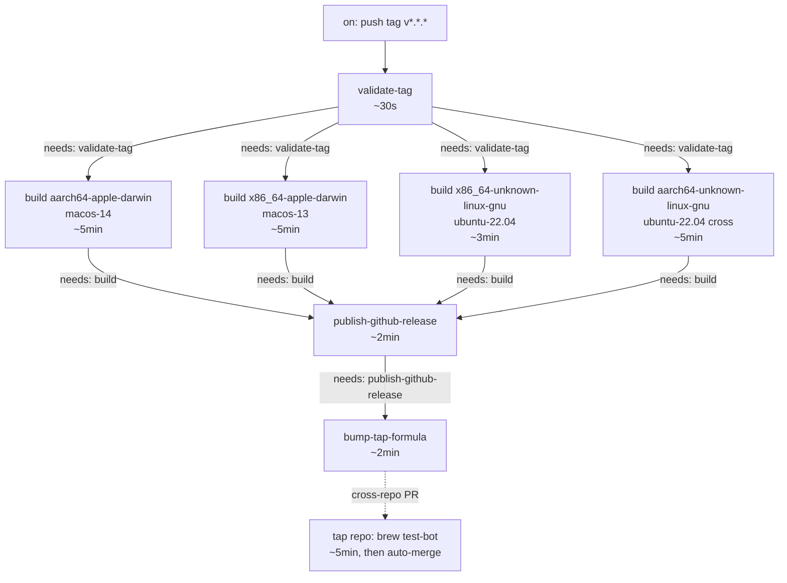

# Component Boundaries — release-process-homebrew-github

**Wave:** DESIGN (3 of 6)
**Date:** 2026-05-03

Defines the responsibilities, interfaces, and ownership of every component in the release pipeline. Each component is bounded by a single responsibility and has a documented interface (CLI subcommand, workflow job inputs/outputs, file format, or repo seam).

## 1. Component Map

```
┌─────────────────────────────── jeffabailey/modeltap (this repo) ────────────────────────────────┐
│                                                                                                 │
│  ┌───── xtask binary (Rust) ──────────┐    ┌───── .github/workflows/release.yml ─────────────┐ │
│  │ subcommands:                       │    │ jobs (DAG):                                     │ │
│  │   release-prep                     │    │   validate-tag                                  │ │
│  │   validate-tag                     │◄───│   build (matrix × 4 targets)                    │ │
│  │   render-formula                   │    │   publish-github-release                        │ │
│  │   extract-changelog                │    │   bump-tap-formula                              │ │
│  │   lint-workflows                   │    └─────────────────────────────────────────────────┘ │
│  └────────────────────────────────────┘                                                         │
│                                                                                                 │
│  ┌───── release/templates/modeltap.rb.tera ─┐  ┌───── git-cliff.toml ─────────────────────┐   │
│  │ Tera template for Homebrew formula        │  │ Conventional-commit section grouping     │   │
│  │ (4 platform blocks + version)             │  │ (feat, fix, chore, refactor, docs, perf) │   │
│  └───────────────────────────────────────────┘  └──────────────────────────────────────────┘   │
│                                                                                                 │
│  ┌───── RELEASING.md ────────────────────────┐  ┌───── secrets ────────────────────────────┐   │
│  │ ≤10 numbered steps + release-log table    │  │ GH_TAP_TOKEN (fine-grained PAT)          │   │
│  └───────────────────────────────────────────┘  └──────────────────────────────────────────┘   │
│                                                                                                 │
└─────────────────────────────────────────────────────────────────────────────────────────────────┘
                                                  │
                                                  ▼  cross-repo: gh + GH_TAP_TOKEN
┌────────────────────────── jeffabailey/homebrew-modeltap (separate repo) ────────────────────────┐
│                                                                                                 │
│  ┌───── Formula/modeltap.rb ─────────────────┐  ┌───── .github/workflows/test-bot.yml ────┐    │
│  │ Auto-rewritten by bump-tap-formula job    │  │ Runs `brew test-bot audit + install +   │    │
│  │ Single user-facing formula                │  │ test` on every PR                       │    │
│  └───────────────────────────────────────────┘  └─────────────────────────────────────────┘    │
│                                                                                                 │
│  ┌───── README.md ───────────────────────────┐  ┌───── branch protection (main) ──────────┐    │
│  │ Hand-maintained; points back to main repo │  │ Requires `brew test-bot` status check   │    │
│  └───────────────────────────────────────────┘  └─────────────────────────────────────────┘    │
│                                                                                                 │
└─────────────────────────────────────────────────────────────────────────────────────────────────┘
```

## 2. The `xtask` Binary

**Type:** Rust workspace member at repo-root `xtask/`, EXCLUDED from default-members so plain `cargo build` / `cargo test` skip it. Invoked as `cargo xtask <subcommand>` via a `[alias]` entry in `.cargo/config.toml` (`xtask = "run --package xtask --"`). See ADR-011.

**Why a separate workspace member**: clean test surface, separate dependency tree (Tera + toml_edit don't pollute production crates), independent versioning. The standard Rust community pattern.

**Internal architecture**: functional core (pure functions over algebraic types) wrapped by an imperative shell (CLI dispatcher + adapter functions that shell out to git/cargo/gh/git-cliff). Mirrors the established `modeltap-core` (pure) vs plugin (I/O) seam.

### 2.1 Subcommand catalog

| Subcommand | Caller | Responsibility | Inputs | Outputs |
|---|---|---|---|---|
| `release-prep` | maintainer (locally) | US-01: bump version, regen changelog, run CI gates locally | `--version X.Y.Z` | mutates `Cargo.toml`, `Cargo.lock`, `CHANGELOG.md`. Exit 0 with next-step message on success. |
| `validate-tag` | `release.yml` validate-tag job | US-02: assert pushed tag matches `Cargo.toml [workspace.package].version` | `--tag v0.2.0` | exit 0 / non-zero with clear stderr message |
| `render-formula` | `release.yml` bump-tap-formula job | US-06 / US-10: render `Formula/modeltap.rb` from template + per-target sha256s + version | `--version`, `--template`, `--output`, `--sha256-dir` (where `*.sha256` files live), `--release-base-url` | writes rendered formula file |
| `extract-changelog` | `release.yml` publish-github-release job | US-05: extract `## [X.Y.Z]` section from `CHANGELOG.md` | `--version`, `--input CHANGELOG.md`, `--output RELEASE_NOTES.md` | writes `RELEASE_NOTES.md`. Fails if section missing. |
| `lint-workflows` | `ci.yml` (drift catch) | US-14: enforce `release.yml` ≤250 lines + every job has `# Purpose:` comment | `--workflow .github/workflows/release.yml --max-lines 250` | exit 0 / non-zero with diagnostic |

### 2.2 Internal contracts (function signatures — interfaces only, not implementations)

The xtask exposes a small library API consumed by the binary, kept under `xtask/src/lib.rs`:

```text
mod version {
    pub fn parse_workspace_version(cargo_toml: &str) -> Result<Version, VersionError>;
    pub fn assert_monotonic(current: &Version, proposed: &Version) -> Result<(), VersionError>;
    pub fn assert_tag_matches(tag: &str, version: &Version) -> Result<(), VersionError>;
}

mod formula {
    pub struct FormulaCtx {
        pub version: Version,
        pub release_base_url: String,
        pub targets: Vec<TargetEntry>,
    }
    pub struct TargetEntry { pub triple: String, pub archive_name: String, pub sha256: String }
    pub fn render(template_text: &str, ctx: &FormulaCtx) -> Result<String, FormulaError>;
}

mod changelog {
    pub fn extract_section(changelog: &str, version: &Version) -> Result<String, ChangelogError>;
}

mod workflow_lint {
    pub struct LintReport { pub line_count: usize, pub jobs_missing_purpose: Vec<String> }
    pub fn lint(yaml_text: &str, max_lines: usize) -> Result<LintReport, LintError>;
}
```

These are interface shapes for software-crafter to refine during RED/GREEN. Internal data types (e.g., the exact `VersionError` enum variants), helper functions, and module decomposition are crafter's call.

### 2.3 Adapter layer

Adapters wrap external tools. They are kept thin (one struct method per shell-out) and have NO logic — they translate a typed input to a CLI invocation and a CLI exit-code/stdout to a typed Result. The functional core never imports adapter modules.

| Adapter | Wraps | Used by |
|---|---|---|
| `git_adapter` | `git status --porcelain`, `git rev-parse`, `git tag --list`, `git log --format` | release-prep (clean-tree check), validate-tag (current ref), extract-changelog (commits range) |
| `cargo_adapter` | `cargo metadata --format-version 1`, `cargo fmt --all -- --check`, `cargo clippy --workspace --all-targets -- -D warnings`, `cargo test --workspace --locked`, `cargo update --workspace` | release-prep |
| `cliff_adapter` | `git-cliff --tag <X.Y.Z> --output CHANGELOG.md` | release-prep |
| `gh_adapter` | `gh release create`, `gh release view --json assets`, `gh pr list --head`, `gh pr create`, `gh pr merge --auto --squash`, `gh attestation verify` | invoked from release.yml steps via xtask, OR directly inline in workflow YAML; choice per subcommand convenience |
| `fs_adapter` | `std::fs::read_to_string`, `std::fs::write`, `tempfile` | every subcommand |

### 2.4 Testability

- **Pure functions in `xtask::version`, `xtask::formula`, `xtask::changelog`, `xtask::workflow_lint`**: unit-testable without any I/O. Take strings in, return strings/Results out. This is where mutation testing earns its keep.
- **Adapter functions**: integration-tested with `assert_cmd` against fixture filesystems. No mocking of the CLI tools themselves — a fake `git` shim is brittle; a real `git init` in a `tempdir` is faithful.
- **Subcommands**: end-to-end-tested via `cargo run -p xtask -- <subcommand> ...` against fixture trees in `xtask/tests/fixtures/`.

## 3. The `release.yml` Workflow

**Type:** Single GitHub Actions workflow file at `.github/workflows/release.yml`. ≤250 lines (US-14). Every job has a `# Purpose:` comment immediately above. See ADR-010 for single-file vs multi-file rationale.

### 3.1 Trigger

```yaml
on:
  push:
    tags: ['v*.*.*']
```

Per US-02. Non-version tags (e.g., `experiment-foo`) do not match and the workflow does not run.

### 3.2 Job DAG



### 3.3 Job-by-job contract

#### `validate-tag`

- **Purpose**: Assert pushed tag matches `Cargo.toml [workspace.package].version` before any other job runs.
- **Runs on**: `ubuntu-latest` (lightest runner — pure git+grep).
- **Steps**:
  1. `actions/checkout@v4` (fetch tag-pointed commit only, no history).
  2. `dtolnay/rust-toolchain@stable` (needed only because xtask calls cargo metadata; could be skipped if validate-tag uses pure shell).
  3. Run `cargo run -p xtask -- validate-tag --tag ${{ github.ref_name }}`.
- **Outputs**: success status; `${{ github.ref_name }}` is propagated as a job output for downstream jobs to read the validated version.
- **Failure mode**: stderr contains `tag <X> does not match workspace version <Y>`; subsequent jobs are skipped automatically (no `needs` is satisfied).

#### `build` (matrix × 4)

- **Purpose**: Run CI parity gates, then build, strip, package, sha256, attest, and upload one archive for one target.
- **Runs on**: per-cell runner (see §4 of `architecture-design.md`).
- **Strategy**: `matrix.target` with 4 entries; `fail-fast: false`.
- **Permissions**: `id-token: write`, `attestations: write`, `contents: read` (provenance attestation needs OIDC).
- **Needs**: `validate-tag`.
- **Steps** (in order — order is load-bearing per C3):
  1. `actions/checkout@v4`
  2. `dtolnay/rust-toolchain@stable` (matches ci.yml)
  3. `Swatinem/rust-cache@v2` keyed per target
  4. (aarch64-linux only) Set up `cross` via `cargo install cross --version 0.2.5 --locked` OR direct `cross-rs` action; ADR-012.
  5. **CI parity gate 1**: `cargo fmt --all -- --check`
  6. **CI parity gate 2**: `cargo clippy --workspace --all-targets -- -D warnings`
  7. **CI parity gate 3**: `cargo test --workspace --locked`
  8. **Build**: `cargo build --release --locked --target ${{ matrix.target }} --package modeltap-app` (or `cross build` on aarch64-linux)
  9. **Strip**: `strip target/${{ matrix.target }}/release/modeltap` (Linux runners pre-install; macOS uses `strip` with default args)
  10. **Package**: `tar -czf modeltap-${VERSION}-${{ matrix.target }}.tar.gz -C target/${{ matrix.target }}/release modeltap`
  11. **Sha256**: `sha256sum modeltap-${VERSION}-${{ matrix.target }}.tar.gz | awk '{print $1}' > modeltap-${VERSION}-${{ matrix.target }}.tar.gz.sha256`
  12. **Attest**: `actions/attest-build-provenance@v2` with `subject-path` = the archive
  13. **Upload**: `actions/upload-artifact@v4` with name `release-${{ matrix.target }}` and the archive + sha256
- **Outputs**: 4 named workflow artifacts (`release-aarch64-apple-darwin`, etc.).
- **Failure mode**: any step exit-non-zero fails the cell; per US-08 atomic guard, the entire publish chain is gated.

#### `publish-github-release`

- **Purpose**: Aggregate all 4 archives + sha256s into a single GitHub Release.
- **Runs on**: `ubuntu-latest`.
- **Permissions**: `contents: write` (required to create releases), `attestations: read`.
- **Needs**: `[validate-tag, build]`.
- **Steps**:
  1. `actions/checkout@v4` (need `CHANGELOG.md`)
  2. `dtolnay/rust-toolchain@stable` (xtask)
  3. `actions/download-artifact@v4` with `pattern: release-*` and `merge-multiple: true` (collects all 4 archives + 4 sha256s)
  4. `cargo run -p xtask -- extract-changelog --version ${VERSION} --input CHANGELOG.md --output RELEASE_NOTES.md` (fails if section missing per US-05.AC-4)
  5. Compute `--prerelease` flag if `${VERSION}` contains `-` (US-05.AC-6)
  6. `gh release create v${VERSION} ./modeltap-*.tar.gz ./*.sha256 --title "v${VERSION}" --notes-file RELEASE_NOTES.md ${PRERELEASE_FLAG}`
- **Outputs**: a published GitHub Release at `https://github.com/jeffabailey/modeltap/releases/tag/v${VERSION}`.

#### `bump-tap-formula`

- **Purpose**: Render the Homebrew formula and open an auto-merging PR against the tap repo.
- **Runs on**: `ubuntu-latest`.
- **Permissions**: `contents: read` (this repo); the cross-repo write happens via `GH_TAP_TOKEN`.
- **Needs**: `publish-github-release`.
- **Steps**:
  1. `actions/checkout@v4` for source repo (need template)
  2. `actions/download-artifact@v4` (need `.sha256` files; do NOT need archives themselves)
  3. `dtolnay/rust-toolchain@stable` (xtask)
  4. `actions/checkout@v4` for `jeffabailey/homebrew-modeltap` with `token: ${{ secrets.GH_TAP_TOKEN }}` and `path: tap-repo`
  5. Set up tap-repo branch: check for existing `bump/v${VERSION}` via `gh pr list --head bump/v${VERSION} --repo jeffabailey/homebrew-modeltap` (US-12 idempotency)
  6. `cargo run -p xtask -- render-formula --version ${VERSION} --template release/templates/modeltap.rb.tera --output tap-repo/Formula/modeltap.rb --sha256-dir . --release-base-url https://github.com/jeffabailey/modeltap/releases/download/v${VERSION}`
  7. `cd tap-repo && git config user.email "github-actions[bot]@users.noreply.github.com" && git config user.name "github-actions[bot]"`
  8. `git checkout -B bump/v${VERSION} && git add Formula/modeltap.rb && git commit -m "modeltap ${VERSION}" && git push --force-with-lease origin bump/v${VERSION}`
  9. If new branch: `gh pr create --repo jeffabailey/homebrew-modeltap --title "modeltap ${VERSION}" --body "Auto-generated by release.yml" --base main --head bump/v${VERSION}`
  10. `gh pr merge --auto --squash --repo jeffabailey/homebrew-modeltap bump/v${VERSION}` (US-11)
- **Outputs**: a tap-repo PR (open or fast-forward of existing); auto-merge armed.
- **Failure mode**: any step exit-non-zero fails the job. Token expiry surfaces as HTTP 401 in `gh` output (US-06.AC-7).

## 4. The `modeltap.rb.tera` Template

**Type:** Tera template at `release/templates/modeltap.rb.tera` in the source repo. Single source for the formula's structure; rendered into the tap repo per release.

**Schema**: see `data-models.md` Section 1 for the FormulaCtx struct shape and a worked example.

**Why in source repo, not tap repo**: the template is the project's choice of formula structure (4 platform blocks, test stanza shape, etc.). Versioning the template alongside the source code means a PR that changes the build matrix can also change the template in the same commit. The tap repo only ever holds the *rendered* formula.

## 5. The `Formula/modeltap.rb` File (in tap repo)

**Type:** Rendered Ruby file in `jeffabailey/homebrew-modeltap`. Single user-facing artifact for `brew install`.

**Lifecycle**: never hand-edited. `bump-tap-formula` is the only writer. US-12 documents the manual-edit-clobber trade-off for emergencies.

**Test stanza** (rendered from template): runs `modeltap --version` and asserts output equals `modeltap ${VERSION}`. This is the cross-repo end-to-end smoke (per shared-artifacts-registry "Integration Checkpoints").

## 6. The `test-bot.yml` Workflow (in tap repo)

**Type:** Single workflow file in `jeffabailey/homebrew-modeltap/.github/workflows/test-bot.yml`. Triggered on every PR.

**Responsibility**: run `brew test-bot --tap jeffabailey/homebrew-modeltap` which executes `audit + install + test` on macos-14, macos-13, and ubuntu-22.04 (the latter with QEMU for aarch64 verification).

**Branch protection** on tap repo `main`: requires `brew test-bot` status check to pass before any merge (one-time setup, documented in `RELEASING.md` per US-11.AC-5).

**File ownership**: this file lives in the tap repo, NOT in this design's source repo. It is included in component boundaries because it is part of the pipeline's correctness story. DESIGN proposes the initial content; the maintainer commits it during first-time tap repo setup.

## 7. The `RELEASING.md` Runbook

**Type:** Markdown at source repo root. ≤80 lines, ≤10 numbered steps (US-13).

**Sections** (in order):
1. **Quick reference** (one-line version: `cargo xtask release-prep --version X.Y.Z && open prep PR && merge && git tag -a vX.Y.Z && git push origin vX.Y.Z`).
2. **The 10 numbered steps** (Branch from main → run release-prep → open PR → merge → checkout main → tag → push tag → watch → verify install → append release log row).
3. **First-time setup** (one-time tasks: create tap repo, set GH_TAP_TOKEN, set tap branch protection).
4. **Operational notes** (token rotation, manual-edit-clobber trade-off cross-ref US-12, macOS Gatekeeper xattr workaround cross-ref D3).
5. **Release log table** (per-release rows; data source for K-T2T).

**File ownership**: source repo root. Hand-maintained by the maintainer per release (one row added).

## 8. The `git-cliff.toml` Config

**Type:** TOML config at source repo root.

**Responsibility**: declare the conventional-commit section grouping (`feat`, `fix`, `chore`, `refactor`, `docs`, `perf`) and the changelog template format. Used by `git-cliff` invoked from `cargo xtask release-prep`.

**Convention pre-existing in repo**: recent commit history already uses `fix(ci):`, `chore(docs):`, `refactor(gpt4all):` prefixes. The repo is "conventional-commits ready" without further author-discipline change.

## 9. The `GH_TAP_TOKEN` Secret

**Type:** GitHub Actions repository secret on `jeffabailey/modeltap`.

**Scope**: fine-grained PAT scoped to `jeffabailey/homebrew-modeltap` ONLY, with permissions `Contents: Read+Write` and `Pull Requests: Read+Write`. No access to any other repo. No org-level scope. See ADR-013.

**Lifecycle**: created manually by maintainer; rotation documented in `RELEASING.md`. Default expiry is GitHub's 1-year max; DEVOPS-side workflow (out of scope for this feature) warns 30 days before expiry.

## 10. Cross-Cutting: What This Design Does NOT Own

These are explicit non-responsibilities, called out so the boundary is unambiguous:

- **Acceptance test design** — owned by acceptance-designer (DISTILL wave, next). This document specifies behavior, not how to test it.
- **xtask Rust source code** — owned by software-crafter (DELIVER wave). The interface shapes in §2.2 are contracts; internal decomposition is crafter's call.
- **`release.yml` line-by-line YAML** — software-crafter writes the workflow per the §3.3 contracts; this document defines structure and constraints, not exact YAML.
- **README content** — owned by software-crafter (DELIVER wave) per US-09.AC-5 and US-13.
- **K-PIPE alerting workflow** — owned by platform-architect (DEVOPS wave) per the DEVOPS handoff in `discuss/wave-decisions.md`.
- **`GH_TAP_TOKEN` expiry monitoring** — out of scope for this feature; tracked separately per DEVOPS handoff.
