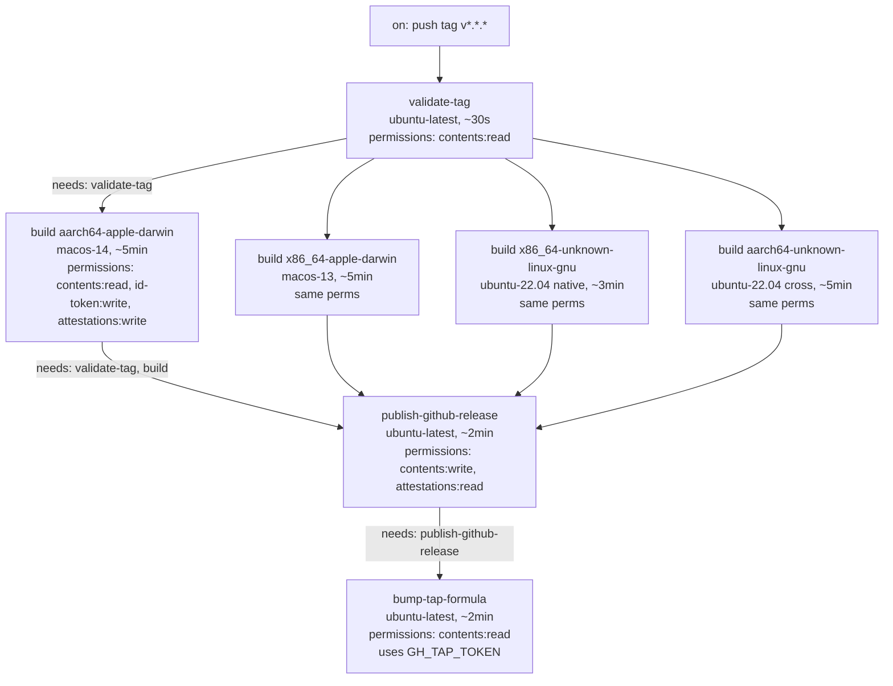

# CI/CD Pipeline — release-process-homebrew-github

**Wave:** DEVOPS (4 of 6)
**Author:** Apex (nw-platform-architect)
**Date:** 2026-05-03

## 1. Pipeline Overview

Two workflows, one tap-repo workflow, plus two follow-up workflows added by this wave:

| Workflow file | Repo | Trigger | Purpose |
|---|---|---|---|
| `.github/workflows/ci.yml` | source | `pull_request: [main]`, `push: [main]` | Existing pre-merge gates (fmt, clippy, test, deny, k3-bench) |
| `.github/workflows/release.yml` | source | `push: tags: [v*.*.*]` | This feature's main pipeline (per ADR-010) |
| `.github/workflows/release-pipeline-alert.yml` | source | `workflow_run: { workflows: [release], types: [completed] }` | NEW. K-PIPE alerting (this wave) |
| `.github/workflows/token-expiry-warning.yml` | source | `schedule: cron weekly` + `workflow_dispatch` | NEW. GH_TAP_TOKEN expiry monitoring (this wave) |
| `.github/workflows/test-bot.yml` | tap | `pull_request` | `brew test-bot` audit + install + test (per US-11; lives in tap repo) |

## 2. release.yml — Job DAG and Permissions

Per DESIGN component-boundaries.md §3 plus DEVOPS-side concerns (permissions, concurrency, artifact retention).

### 2.1 Trigger and top-level

```yaml
name: release

on:
  push:
    tags: ['v*.*.*']

# No `concurrency:` — distinct tags are distinct releases; parallel safe.

permissions:
  contents: read   # default minimum; per-job permissions widened where needed

env:
  CARGO_TERM_COLOR: always
  RUSTFLAGS: "-D warnings"   # mirrors ci.yml C7
  RUST_BACKTRACE: 1
```

### 2.2 Job DAG



### 2.3 Per-job permission matrix

| Job | `contents` | `id-token` | `attestations` | Other |
|---|---|---|---|---|
| `validate-tag` | read | (none) | (none) | (none) |
| `build` (per cell) | read | write | write | (id-token + attestations needed by `actions/attest-build-provenance@v2`) |
| `publish-github-release` | write | (none) | read | (write needed for `gh release create`) |
| `bump-tap-formula` | read | (none) | (none) | Uses `${{ secrets.GH_TAP_TOKEN }}` for cross-repo write — does NOT need source-repo `contents:write` |

**Least privilege**: every job gets exactly the permissions it needs and no more. This is the GitHub Actions equivalent of IAM role scoping.

### 2.4 Secret matrix

| Secret | Source | Used by | Scope |
|---|---|---|---|
| `GITHUB_TOKEN` | auto-provided per job | `validate-tag` (checkout), `build` (checkout, OIDC exchange, artifact upload), `publish-github-release` (gh release create), `bump-tap-formula` (source-repo checkout) | Per-job, repo-scoped, ephemeral |
| `GH_TAP_TOKEN` | manually provisioned (per ADR-013) | `bump-tap-formula` only — for tap-repo checkout, push, `gh pr create`, `gh pr merge --auto` | Fine-grained PAT; Contents:RW + PRs:RW on `jeffabailey/homebrew-modeltap` only |

**Critical**: `GH_TAP_TOKEN` is referenced ONLY in the `bump-tap-formula` job. Other jobs cannot accidentally use it (GH Actions does not pass secrets to jobs that don't reference them).

### 2.5 Pinned action versions (per technology-stack.md)

| Action | Pin | Used in |
|---|---|---|
| `actions/checkout@v4` | major | every job |
| `dtolnay/rust-toolchain@stable` | floating "stable" | every job that needs cargo |
| `Swatinem/rust-cache@v2` | major | `build`, `publish-github-release`, `bump-tap-formula` |
| `actions/upload-artifact@v4` | major | `build` |
| `actions/download-artifact@v4` | major | `publish-github-release`, `bump-tap-formula` |
| `actions/attest-build-provenance@v2` | major (per US-09) | `build` only; requires `id-token: write` |
| `EmbarkStudios/cargo-deny-action@v2` | major | `build` (CI parity per C3) |

Pinning is to **major version only** — gets bug fixes, blocks breaking changes. Annual review of pins recommended (see `monitoring-alerting.md` §6).

### 2.6 Cache strategy

`Swatinem/rust-cache@v2` keys per (target, Cargo.lock hash). Keys overlap with `ci.yml` where possible:

| Cache scope | Key shape | Sharing with ci.yml |
|---|---|---|
| `build` aarch64-apple-darwin | `${{ runner.os }}-cargo-aarch64-apple-darwin-${{ hashFiles('**/Cargo.lock') }}` | Shared with `ci.yml test (macos-latest)` cache when `macos-latest` resolves to macos-14 |
| `build` x86_64-apple-darwin | `${{ runner.os }}-cargo-x86_64-apple-darwin-${{ hashFiles('**/Cargo.lock') }}` | Independent (ci.yml does not target Intel macOS specifically) |
| `build` x86_64-unknown-linux-gnu | `${{ runner.os }}-cargo-x86_64-unknown-linux-gnu-${{ hashFiles('**/Cargo.lock') }}` | Shared with `ci.yml test (ubuntu-latest)` |
| `build` aarch64-unknown-linux-gnu (cross) | `${{ runner.os }}-cargo-cross-aarch64-${{ hashFiles('**/Cargo.lock') }}` | Independent (cross uses Docker, separate cache surface) |
| `publish-github-release` | (no cargo-cache; downloads artifacts only) | n/a |
| `bump-tap-formula` | `${{ runner.os }}-cargo-xtask-${{ hashFiles('xtask/Cargo.toml', 'Cargo.lock') }}` | Independent (xtask-only build) |

Cache hit rate after first release: expected ~85%+ on warm runs; first release post-feature-merge will be cold (~25 min total) per DESIGN K-T2T budget.

### 2.7 Artifact retention

`actions/upload-artifact@v4` defaults to 90-day retention. Override:

```yaml
- uses: actions/upload-artifact@v4
  with:
    name: release-${{ matrix.target }}
    path: |
      modeltap-*.tar.gz
      modeltap-*.tar.gz.sha256
    retention-days: 7   # short — these are intra-workflow handoff only; canonical store is GH Releases
```

7-day retention because the artifacts exist for cross-job handoff between `build` and `publish`/`bump`. After publish, the canonical store is GitHub Releases (effectively permanent).

## 3. Quality Gate Map

Per skill `nw-cicd-and-deployment` Gate Taxonomy section, applied to release.yml:

| Stage | Gate type | Gate | Pass criterion | Failure action |
|---|---|---|---|---|
| Local pre-tag (US-01) | Local blocking | `cargo xtask release-prep` | Clean tree + fmt + clippy + test + deny all pass | Maintainer fixes locally; never tags |
| PR pre-merge | PR blocking | `ci.yml` (existing) | All 5 ci jobs pass | Maintainer fixes; PR not merged |
| CI commit stage (release.yml validate-tag) | CI blocking | tag matches Cargo.toml version | string equality | Workflow fails; downstream skipped |
| CI build stage — fmt | CI blocking | `cargo fmt --all -- --check` | exit 0 | Cell fails; publish gated |
| CI build stage — clippy | CI blocking | `cargo clippy --workspace --all-targets -- -D warnings` | exit 0 | Cell fails; publish gated |
| CI build stage — test | CI blocking | `cargo test --workspace --locked` | exit 0 | Cell fails; publish gated |
| CI build stage — deny | CI blocking | `cargo deny check` | exit 0 (license + advisory + bans + sources all green) | Cell fails; publish gated |
| CI build stage — workflow lint | CI blocking | `cargo run -p xtask -- lint-workflows --max-lines 250` | line count ≤ 250 + every job has `# Purpose:` comment | Cell fails (only relevant in ci.yml; release.yml includes the lint as part of pre-build gates) |
| CI build stage — build | CI blocking | `cargo build --release --locked --target X --package modeltap-app` | exit 0 | Cell fails; publish gated |
| CI build stage — strip | CI blocking | `strip target/X/release/modeltap` | exit 0 | Cell fails; publish gated |
| CI build stage — package | CI blocking | tar.gz + sha256 produced | files exist | Cell fails; publish gated |
| CI build stage — attest | CI blocking | `actions/attest-build-provenance@v2` | attestation file produced and signed | Cell fails; publish gated (US-09 / K-PROV) |
| CI publish stage — extract changelog | CI blocking | `xtask extract-changelog` | `## [X.Y.Z]` section found in CHANGELOG.md | Job fails; bump skipped |
| CI publish stage — gh release create | CI blocking | `gh release create v${VERSION} ...` | release created with all 4 archives + sidecars + attestations | Job fails; bump skipped |
| Cross-repo bump stage — render-formula | CI blocking | `xtask render-formula` | rendered formula written | Job fails; no PR |
| Cross-repo bump stage — git push | CI blocking | force-push-with-lease to `bump/v${VERSION}` | exit 0 | Job fails; partial state cleaned by US-12 retry |
| Cross-repo bump stage — gh pr create / pr merge --auto | CI blocking | PR opened, auto-merge armed | PR exists; merge state = PENDING | Job fails; partial state cleaned by US-12 retry |
| Tap repo brew test-bot | Deploy gate (auto) | `brew test-bot` audit + install + test on macos-14, macos-13, ubuntu-22.04 | all pass | Auto-merge withholds; PR sits open visibly (US-11) |
| Post-merge | Advisory | end-user `brew install` works on all 4 platforms | maintainer's manual K-COVER spot-check | `release-pipeline-failure` issue opened if K-COVER drops below 100% |

**Quality gate threshold versioning**: thresholds (250-line workflow limit, 80% mutation kill rate, 80% coverage) are stored as constants in source — `xtask` source code, `CLAUDE.md`, `cargo deny.toml`. Not hardcoded in pipeline YAML. Per skill principle: "Gate thresholds are documented and versioned (not hardcoded in pipeline YAML)."

## 4. release-pipeline-alert.yml — K-PIPE Alerting Follow-Up Workflow

NEW workflow, this wave's deliverable. Closes DEVOPS handoff item #1 and Eclipse-flagged K-PIPE alerting.

### 4.1 Purpose

When `release.yml` fails (any job, any conclusion = `failure` / `cancelled` / `timed_out`), automatically open a GitHub Issue tagged `release-pipeline-failure` with a link to the failing run. This makes K-PIPE measurable and acted-upon, per `outcome-kpis.md` "Handoff Notes for DEVOPS" §4.

### 4.2 Spec

```yaml
name: release-pipeline-alert

on:
  workflow_run:
    workflows: [release]
    types: [completed]

permissions:
  contents: read
  issues: write   # to file the failure issue

jobs:
  alert-on-failure:
    if: ${{ github.event.workflow_run.conclusion != 'success' }}
    runs-on: ubuntu-latest
    steps:
      - name: Open release-pipeline-failure issue
        env:
          GH_TOKEN: ${{ secrets.GITHUB_TOKEN }}
          RUN_URL: ${{ github.event.workflow_run.html_url }}
          RUN_ID: ${{ github.event.workflow_run.id }}
          CONCLUSION: ${{ github.event.workflow_run.conclusion }}
          DISPLAY_TITLE: ${{ github.event.workflow_run.display_title }}
        run: |
          set -euo pipefail
          TITLE="release pipeline failed: ${DISPLAY_TITLE} (${CONCLUSION})"
          BODY=$(cat <<EOF
          The release workflow concluded with status: **${CONCLUSION}**.

          - Run: ${RUN_URL}
          - Run ID: ${RUN_ID}
          - Display title: ${DISPLAY_TITLE}

          ## Triage checklist (per RELEASING.md)
          - [ ] Identify failing job in run log
          - [ ] Classify root cause (toolchain / test / network / token / formula render / tap-repo state / other)
          - [ ] If transient: re-run failed jobs in GH UI (US-12 idempotent retry covers bump-tap-formula)
          - [ ] If real bug: file a fix PR; do NOT re-tag until fix lands on main
          - [ ] Once resolved: close this issue with root-cause comment for K-PIPE quarterly review

          ## K-PIPE impact
          This failure counts against K-PIPE rolling-10 success rate. Target: ≥95%.
          EOF
          )
          gh issue create \
            --title "${TITLE}" \
            --body "${BODY}" \
            --label "release-pipeline-failure" \
            --repo "${{ github.repository }}"
```

### 4.3 Routing decision

**Maintainer is notified via standard GitHub notifications** for the new issue (because the maintainer is the repo owner / watcher). No email/Slack/Discord webhook — per D5 (GitHub-native only) and DISCUSS C5 (privacy by default).

GitHub's default notification settings already deliver issue creation to the repo owner via:

- web notification at github.com (immediate)
- email notification if maintainer has email-on-issue enabled in their notification settings (default: yes for issues you author/assign/are mentioned in)

We add `--assignee ${{ github.repository_owner }}` to the `gh issue create` call to guarantee the maintainer is mentioned, ensuring email notification regardless of watch settings.

### 4.4 Issue label management

The `release-pipeline-failure` label must exist in the repo. One-time setup (documented in `RELEASING.md` "First-time setup"):

```bash
gh label create release-pipeline-failure \
  --color "B60205" \
  --description "K-PIPE: a release.yml run failed; needs root-cause analysis" \
  --repo jeffabailey/modeltap
```

### 4.5 Self-test (first-deploy validation)

To prove the alerting path works, perform once after first feature merge:

1. Create a temporary tag `v0.0.0-alert-test`
2. Push it (intentionally cause `validate-tag` to fail because `0.0.0-alert-test` ≠ `Cargo.toml` version)
3. Verify `release-pipeline-failure` issue appears within ~2 minutes
4. Close the issue; delete the tag

This validates `workflow_run` event delivery, label creation, and issue notification end-to-end. Documented as step in `RELEASING.md` "First-time setup".

## 5. token-expiry-warning.yml — GH_TAP_TOKEN Expiry Monitoring

NEW workflow, this wave's deliverable. Closes DEVOPS handoff item #3.

### 5.1 Purpose

`GH_TAP_TOKEN` is a fine-grained PAT with a 365-day max expiry per ADR-013. Silent expiry breaks the next release at `bump-tap-formula`. This scheduled workflow checks token validity weekly and opens an issue when expiry is ≤30 days away or the token has already been revoked.

### 5.2 Spec

```yaml
name: token-expiry-warning

on:
  schedule:
    - cron: '0 13 * * 1'   # Mondays 13:00 UTC = 06:00 PT, 09:00 ET
  workflow_dispatch:        # manual trigger for ad-hoc check

permissions:
  contents: read
  issues: write

jobs:
  check-tap-token:
    runs-on: ubuntu-latest
    steps:
      - name: Probe GH_TAP_TOKEN
        env:
          GH_TOKEN: ${{ secrets.GH_TAP_TOKEN }}
        id: probe
        run: |
          set -euo pipefail
          # Simplest validity check: list the tap repo (the only thing the token is scoped to)
          if ! gh api /repos/jeffabailey/homebrew-modeltap > /dev/null 2>&1; then
            echo "status=invalid" >> "$GITHUB_OUTPUT"
            exit 0
          fi
          echo "status=valid" >> "$GITHUB_OUTPUT"
          # Note: GH API does not expose PAT expiry timestamp. We rely on the maintainer
          # recording rotation date in RELEASING.md "operational notes" section, and on
          # this probe to catch revocation/expiry by failure-to-authenticate.

      - name: Open warning issue if invalid
        if: steps.probe.outputs.status == 'invalid'
        env:
          GH_TOKEN: ${{ secrets.GITHUB_TOKEN }}
        run: |
          set -euo pipefail
          # Idempotency: only create issue if no open one exists
          EXISTING=$(gh issue list \
            --label "tap-token-expiry" \
            --state open \
            --repo "${{ github.repository }}" \
            --json number \
            --jq '. | length')
          if [ "${EXISTING}" -gt 0 ]; then
            echo "Open tap-token-expiry issue already exists; skipping."
            exit 0
          fi
          gh issue create \
            --title "GH_TAP_TOKEN appears invalid or expired" \
            --body "$(cat <<EOF
          The scheduled tap-token probe failed to authenticate against jeffabailey/homebrew-modeltap.

          **Likely causes**: token expired, token revoked, token rotated but secret not updated.

          **Action required (rotation procedure per RELEASING.md)**:
          1. Generate replacement fine-grained PAT scoped to jeffabailey/homebrew-modeltap (Contents:RW + PRs:RW)
          2. Update GH_TAP_TOKEN secret in repo settings
          3. Re-run this workflow via 'workflow_dispatch' to confirm
          4. Close this issue

          **K-PIPE impact**: bump-tap-formula will fail on next tag push if not rotated.

          See ADR-013 for credential design.
          EOF
          )" \
            --label "tap-token-expiry" \
            --assignee "${{ github.repository_owner }}" \
            --repo "${{ github.repository }}"
```

### 5.3 Limitations

GitHub does NOT expose PAT expiry-timestamp via any API endpoint. We can only detect:

1. **Token already invalid** (revoked / expired) — caught by failed `gh api` call
2. **Token still valid** — but with no advance warning of impending expiry

To get the 30-day advance warning, the maintainer must record the issue date in `RELEASING.md` "operational notes" when rotating. A future enhancement (out of scope this wave) could add a calendar reminder via `actions/github-script` reading from a `TOKEN_EXPIRY` repo variable that the maintainer updates on rotation.

For v1, "fail-on-actual-expiry" is the gate. The week between expiry and next release is acceptable for a single-maintainer project; the alert + RELEASING.md rotation procedure cover the operational path.

### 5.4 Label setup

```bash
gh label create tap-token-expiry \
  --color "FBCA04" \
  --description "GH_TAP_TOKEN may be expired or revoked; rotation needed" \
  --repo jeffabailey/modeltap
```

## 6. Local Quality Gates (Pre-Commit / Pre-Push)

Per skill mandate: every remote CI gate has a local equivalent. For the maintainer, this is `cargo xtask release-prep` (US-01) which mirrors release.yml's CI parity gates locally before the tag is pushed.

For ordinary contributor PRs (touching xtask, ci.yml, or release.yml), recommend a `lefthook.yml` mirroring CI commit-stage:

```yaml
# lefthook.yml (recommended; not part of this design's mandatory output)
pre-commit:
  parallel: true
  commands:
    fmt:
      run: cargo fmt --all -- --check
      stage_fixed: true
    clippy:
      run: cargo clippy --workspace --all-targets -- -D warnings
      tags: rust

pre-push:
  parallel: false
  commands:
    test:
      run: cargo test --workspace --locked
    deny:
      run: cargo deny check
```

Trade-off: pre-push gates run the full test suite (~minutes). Acceptable because tag pushes are infrequent. Pre-commit stays under 30s per skill principle (fmt + clippy on changed files via lefthook's `{staged_files}` capability).

Local hooks DO NOT replace CI; CI remains the authoritative gate. `--no-verify` is permitted for emergencies.

`lefthook.yml` setup is documented in `RELEASING.md` "First-time setup" but not enforced — contributors who skip it are caught by CI on PR open.

## 7. Pinned Action Version Annual Review

Recommended cadence: every January, audit:

| Pin | Current | Latest as of audit | Migration check |
|---|---|---|---|
| `actions/checkout@v4` | v4 | (audit) | Run release on a non-prod tag; verify checkout works |
| `dtolnay/rust-toolchain@stable` | stable | n/a (floating) | CI catches drift |
| `Swatinem/rust-cache@v2` | v2 | (audit) | Cache key compatibility check |
| `actions/upload-artifact@v4` | v4 | (audit) | v3→v4 was breaking; assume v5 will be too |
| `actions/download-artifact@v4` | v4 | (audit) | Same as above |
| `actions/attest-build-provenance@v2` | v2 | (audit) | SLSA L3 spec stability check |
| `EmbarkStudios/cargo-deny-action@v2` | v2 | (audit) | License-allowlist regression check |

Documented as RELEASING.md "operational notes" task. Owner: maintainer.

## 8. Cross-Reference

- DESIGN `architecture-design.md` §4.2 (container diagram) and §8 (quality attribute strategies)
- DESIGN `component-boundaries.md` §3 (per-job contracts)
- DESIGN ADR-010 (single-workflow DAG)
- DESIGN ADR-013 (PAT credential)
- DEVOPS `monitoring-alerting.md` (rollback, rate-limiting, README troubleshooting)
- DEVOPS `infrastructure-integration.md` (ci.yml coexistence, cache key sharing)
- DEVOPS `kpi-instrumentation.md` (per-KPI source/method/cadence)
- Existing `.github/workflows/ci.yml`
