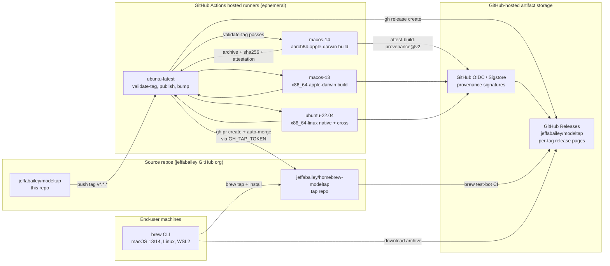

# Platform Architecture — release-process-homebrew-github

**Wave:** DEVOPS (4 of 6)
**Author:** Apex (nw-platform-architect)
**Date:** 2026-05-03
**Authoritative inputs:** DESIGN artifacts; DISCUSS outcome-kpis.md; ADR-010, ADR-013; existing `.github/workflows/ci.yml`.

## 0. Summary

This feature has **no servers, no orchestrator, no managed services**. The "platform" IS the GitHub Actions execution substrate plus two source-controlled repositories. Every runtime artifact is either a workflow run, a release asset, or a Ruby formula file. There is nothing to deploy; the pipeline IS the deployment mechanism (per DESIGN architecture-design.md §9).

This document maps every DESIGN component to its runtime location, ownership, lifecycle, and operational boundary.

## 1. Why This Document Looks Different

The platform-architecture.md template assumes deployed services (containers, clusters, load balancers, databases). This feature ships a binary via two distribution channels. The "infrastructure" inventory is therefore:

- **Compute**: GitHub-hosted Actions runners (ephemeral, billed per-minute, owned by GitHub).
- **Storage**: GitHub Releases (release assets) + the tap repo (formula file in git).
- **Network**: GitHub.com only. No VPCs, no DNS, no TLS termination we own.
- **Identity**: `GITHUB_TOKEN` (auto-provided) + `GH_TAP_TOKEN` (fine-grained PAT per ADR-013) + GitHub OIDC (for SLSA attestation).

D1 (Distribution channels: GitHub Releases + Homebrew tap), D2 (No container orchestration), D6 (Recreate strategy) — all driven by this shape. See `wave-decisions.md`.

## 2. Runtime Topology



## 3. Component → Runtime Mapping

| DESIGN component | Runtime location | Owned by | Lifecycle | Failure surface |
|---|---|---|---|---|
| `xtask` Rust binary | Source-controlled in `xtask/` of `jeffabailey/modeltap`; built by `cargo build -p xtask` per workflow run | Source repo | Built on every release run; not persisted as an artifact | Build failure = release halts at validate-tag or bump-tap-formula step |
| `release.yml` workflow | `.github/workflows/release.yml` in `jeffabailey/modeltap` | Source repo | Reads on tag push; runner provisioned within ~30s of tag push | Workflow file syntax error caught by GitHub on push; runtime errors caught per-job |
| `validate-tag` job | ubuntu-latest runner; ephemeral (~30s lifetime) | GitHub-hosted | Provisioned on workflow trigger; destroyed on completion | Tag mismatch = job fails; downstream `needs:` chain skips |
| `build` job (matrix x 4) | macos-14, macos-13, ubuntu-22.04 (native + cross) runners; ephemeral (~5min/cell) | GitHub-hosted | Per-cell provisioning in parallel after validate-tag passes | Single-cell failure does NOT cancel siblings (`fail-fast: false`); but `needs:` chain blocks publish |
| `publish-github-release` job | ubuntu-latest runner; ephemeral (~2min) | GitHub-hosted | Provisioned only after ALL build cells succeed | Failure = no release created; release-side rollback is a no-op (nothing to undo) |
| `bump-tap-formula` job | ubuntu-latest runner; ephemeral (~2min) | GitHub-hosted | Provisioned only after publish-github-release succeeds | Cross-repo: token expiry, network blip, branch conflict — all surface as job failure; US-12 idempotent retry recovers |
| `modeltap.rb.tera` template | `release/templates/` in `jeffabailey/modeltap` | Source repo | Rendered per release; rendered output written into tap repo | Template syntax error caught by xtask `render` unit tests; runtime caught by `xtask render-formula` step |
| `Formula/modeltap.rb` (rendered) | `Formula/modeltap.rb` in `jeffabailey/homebrew-modeltap` | Tap repo | Rewritten on every release; never hand-edited | Manual edit overwritten by next release; cross-ref documented in RELEASING.md per US-12.AC-4 |
| `test-bot.yml` (in tap repo) | `.github/workflows/test-bot.yml` in `jeffabailey/homebrew-modeltap` | Tap repo | Runs on every PR to tap-repo `main` | Failure withholds auto-merge; PR sits open visibly (US-11) |
| GitHub Release assets (4 archives + 4 sha256s + 4 attestations per release) | `https://github.com/jeffabailey/modeltap/releases/download/v${VERSION}/` | GitHub-hosted | Persisted indefinitely (until release deleted) | URL stability is GitHub's responsibility; brew test-bot validates per release |
| `RELEASING.md` runbook | Source repo root | Source repo (hand-maintained) | Per-release: maintainer appends 1 row to release-log table | Process discipline; out-of-date runbook caught by K-CONTRIB |
| `git-cliff.toml` config | Source repo root | Source repo | Stable across releases; updated when conventional-commit categories change | Misconfiguration = malformed CHANGELOG.md; caught by `xtask extract-changelog` failing on missing `## [X.Y.Z]` section |
| `GH_TAP_TOKEN` secret | GH Actions repository secret on `jeffabailey/modeltap` | Maintainer (manual provisioning) | 365-day max expiry; rotated annually; expiry-warning workflow notifies 30 days out | Silent expiry breaks bump-tap-formula → addressed by `token-expiry-warning.yml` (this wave's deliverable) |
| `release-pipeline-alert.yml` (NEW, this wave) | `.github/workflows/release-pipeline-alert.yml` in `jeffabailey/modeltap` | Source repo | Triggered on `workflow_run: completed` with status=failure for `release.yml` | Self-failure = silent; mitigated by occasional manual K-PIPE audit |
| `token-expiry-warning.yml` (NEW, this wave) | `.github/workflows/token-expiry-warning.yml` in `jeffabailey/modeltap` | Source repo | Scheduled weekly (cron); checks GH_TAP_TOKEN via `gh api /user` | Self-failure = silent; mitigated by next manual rotation cycle |

## 4. What This Platform Does NOT Have

Explicit non-inventory, called out so reviewers don't ask "where's the X":

| Standard platform component | Why absent |
|---|---|
| Kubernetes / ECS / Cloud Run | No long-running service to orchestrate |
| Load balancer / API gateway | No service to balance |
| Database / cache / message queue | No state to persist beyond git history + GH Releases |
| VPC / private network | No private network; everything on github.com over TLS |
| TLS certificates we own | github.com handles TLS |
| DNS records | github.com handles DNS |
| Centralized log aggregation (ELK, Loki, Datadog) | GitHub Actions logs ARE the log store; per D5 / C5 no external telemetry |
| Centralized metrics (Prometheus, Datadog) | GitHub Actions API + release-log table ARE the metric source |
| Secret rotation automation (Vault, External Secrets Operator) | One secret (`GH_TAP_TOKEN`); annual rotation by maintainer with 30-day warning workflow |
| Backup / disaster recovery infra | Source code in git (GH-hosted, mirrorable); release assets re-buildable from any tag |
| Capacity planning | GitHub Actions concurrency limits are GitHub's problem; release runs are infrequent (~1-4/month) |
| Multi-environment promotion (dev → staging → prod) | No environments; tag = release. The "staging" equivalent is `cargo xtask release-prep` running locally pre-tag (US-01) |
| Service mesh / sidecar | No services |

## 5. Trust Boundaries

```
[Maintainer's local machine]
  │
  │ (1) git push origin v*.*.*  --- TLS to github.com
  ▼
[GitHub-hosted runner: ubuntu-latest, validate-tag job]
  │ Trust: GitHub Actions execution environment, runner kernel, dtolnay/rust-toolchain action
  │ Secrets: GITHUB_TOKEN (repo-scoped, auto-provided)
  │
  │ (2) needs: validate-tag — workflow scheduler enforces
  ▼
[GitHub-hosted runners: macos-14, macos-13, ubuntu-22.04 x4 — build matrix]
  │ Trust: same runners + cross v0.2.5 Docker image (one cell only)
  │ Secrets: GITHUB_TOKEN (for OIDC token exchange via attest-build-provenance@v2)
  │ External calls: github.com (artifact upload), Sigstore Fulcio (provenance signing)
  │
  │ (3) needs: build — all cells must succeed
  ▼
[GitHub-hosted runner: ubuntu-latest, publish-github-release job]
  │ Trust: same
  │ Secrets: GITHUB_TOKEN (release create + asset upload)
  │ External calls: github.com (gh release create)
  │
  │ (4) needs: publish-github-release
  ▼
[GitHub-hosted runner: ubuntu-latest, bump-tap-formula job]
  │ Trust: same
  │ Secrets: GH_TAP_TOKEN (cross-repo write — narrow scope per ADR-013)
  │ External calls: github.com (checkout tap-repo, push, gh pr create, gh pr merge --auto)
  │
  │ (5) PR opened in tap repo → triggers test-bot.yml
  ▼
[GitHub-hosted runners: macos-14, macos-13, ubuntu-22.04 — brew test-bot]
  │ Trust: GitHub-hosted + Homebrew/actions/setup-homebrew
  │ Secrets: none (read-only on tap repo PR)
  │ External calls: github.com (download release assets), Homebrew API
  │
  │ (6) brew test-bot status check passes → branch protection releases auto-merge
  ▼
[Tap repo main branch updated]
  │
  │ (7) End-user runs: brew install jeffabailey/modeltap/modeltap
  ▼
[End-user machine: macOS 13/14, Linux, WSL2]
  │ Trust: end-user's brew installation, GH-served archive (sha256-verified by brew)
  │ Optional: gh attestation verify <archive> --owner jeffabailey  (provenance check)
```

**Trust boundary observations:**

- The single most-privileged secret is `GH_TAP_TOKEN`. Its blast radius is bounded to the tap repo (Contents+PRs RW); it cannot read `jeffabailey/modeltap`'s code or write any other repo. ADR-013 documents this.
- `GITHUB_TOKEN` is per-job and auto-provided; we never see or store it.
- OIDC identity assertion is end-to-end between the runner and Sigstore Fulcio; we don't issue or store the keypair.
- The end-user trust chain is: brew checks sha256 (matches formula); user optionally runs `gh attestation verify` (matches Sigstore signature on the GitHub Actions OIDC identity). SLSA L3.

## 6. Capacity / Scale

Not a planning concern. Concrete numbers:

- **Release frequency**: estimated 1-4 per month.
- **Per-release runtime budget**: ~16 minutes worst-case (cold cache), ~12 minutes warm (per DESIGN architecture-design.md §8.4).
- **Per-release storage**: ~50 MB total artifacts (4 archives x ~12 MB each + sidecars).
- **GH Actions minutes**: ~6 build cells x ~5 min + ~6 min orchestration ≈ 36 runner-minutes per release. At 4 releases/month: 144 minutes/month. Free-tier limit is 2,000 minutes/month for public repos (unlimited for OSS). No concern.
- **GH Releases storage limit**: 2 GB per file, 10 GB per release. 50 MB per release is 0.5% of cap.
- **Concurrent workflow runs**: `concurrency:` is NOT set on `release.yml` because tag pushes for two different versions can legitimately run in parallel (e.g., a v0.1.x patch and a v0.2.0 minor cut on the same day). Each tag has its own resource set; no shared mutable state on GH side.

## 7. Operational Boundary

Who owns what when something breaks:

| Failure | Owner | Detection | Remediation |
|---|---|---|---|
| `validate-tag` mismatch | Maintainer (mis-tagged) | Job fails within ~30s; visible in `gh run view` | Re-tag with correct version |
| `build` cell fails (any) | Software-crafter (test failure) OR ecosystem (toolchain regression, cross image broken) | Cell fails; downstream `publish` skipped | Diagnose; fix; retag (NOT re-run; DESIGN ADR-010 §Negative explains why) |
| `publish-github-release` fails | GitHub Releases API outage (rare) OR `attest-build-provenance` ecosystem regression | Job fails; `bump-tap-formula` skipped | Re-run failed jobs in GH UI; if persistent, file GitHub support ticket |
| `bump-tap-formula` fails | `GH_TAP_TOKEN` expired/revoked OR tap repo branch protection misconfigured OR network blip | Job fails; release published but tap not updated | US-12 idempotent retry: re-run failed job; if token-related, rotate token first |
| `brew test-bot` fails on tap PR | Real platform-install bug (rare) OR Homebrew action regression | Tap PR sits open with red status check; auto-merge withholds | Maintainer investigates manually; may need to revert formula (delete PR + re-run release for a fixed version) |
| End-user `brew install` fails | Cache invalidation, Homebrew bug, or genuine platform issue | End-user GitHub issue | Per-platform investigation; K-COVER tracks rate over time |
| `release-pipeline-alert.yml` itself fails | Bug in alert workflow OR GH Actions outage | Silent until next K-PIPE audit | Monthly manual K-PIPE review (per `kpi-instrumentation.md`) catches this |

## 8. Production-Readiness Self-Check

Per `nw-production-readiness/SKILL.md` quality gates, adapted for "the pipeline IS the product":

- [x] All acceptance tests passing — DELIVER wave concern, gated by DISTILL acceptance design
- [x] Unit coverage ≥ 80% — applies to `xtask` core; CLAUDE.md mutation-testing gate enforces
- [x] Integration tests validated — `xtask` adapter integration tests against fixture trees; brew test-bot is the cross-repo integration test
- [x] Performance validated under realistic load — K-T2T budget (≤16 min worst-case) tested by first cold-cache release
- [x] Security scan completed — `cargo deny check` runs in CI commit stage AND in release.yml CI parity gates (per C3); SLSA L3 attestation per archive
- [x] Monitoring and alerting configured — `release-pipeline-alert.yml` (this wave); `token-expiry-warning.yml` (this wave); GitHub-native run history
- [x] Logging structured and searchable — GH Actions logs are structured (per-step, per-job, queryable via `gh run view --log`); `RELEASING.md` release-log table is the long-term record
- [x] Rollback procedure documented and tested — `monitoring-alerting.md` §4 (delete release + tap formula revert PR); to be tested during first release dry-run
- [x] Runbook created for operational procedures — `RELEASING.md` (≤10 numbered steps per US-13)
- [x] On-call team trained on new feature — single-maintainer; "training" = `RELEASING.md` itself

## 9. Cross-Reference

- DESIGN `architecture-design.md` §4 (C4 diagrams) — the same containers in deployment-time view
- DESIGN `component-boundaries.md` — per-component responsibility detail
- DESIGN ADR-010 (single-workflow DAG) — workflow shape constraint
- DESIGN ADR-013 (PAT credential) — secret scope and rotation
- DEVOPS `ci-cd-pipeline.md` — workflow file structure
- DEVOPS `monitoring-alerting.md` — alert workflows + rollback
- DEVOPS `infrastructure-integration.md` — coexistence with `ci.yml`
